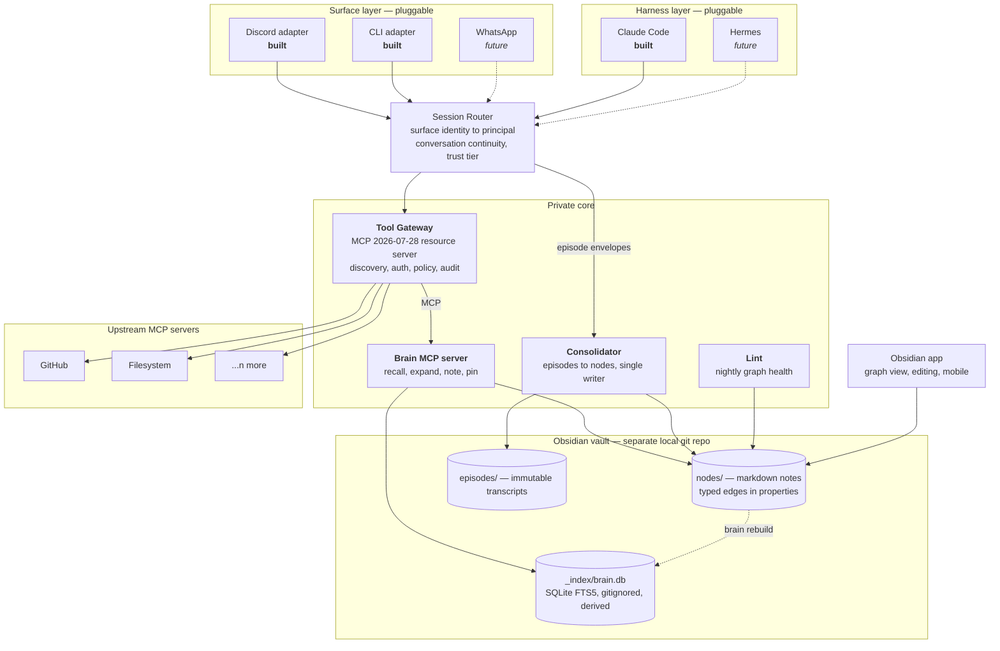

# System Overview

> Part of [`architecture/`](./README.md). Section numbers (§N) are stable across files — grep them.

## 2. System overview

**Two durable assets, everything else replaceable.** The Tool Gateway and the Brain sit behind versioned contracts. Surfaces and harnesses are plugins. The vault is plain markdown that outlives every line of this code.

---

---

[← Index](./README.md)
