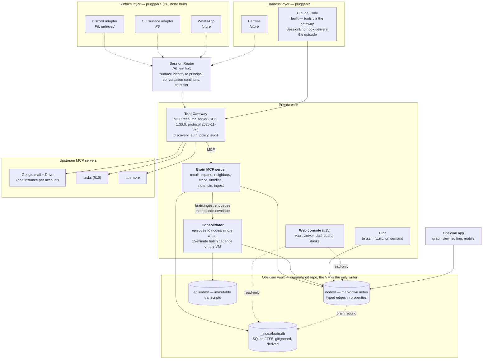

# System Overview

> Part of [`architecture/`](./README.md). Section numbers (§N) are stable across files — grep them.

## 2. System overview

**Two durable assets, everything else replaceable.** The Tool Gateway and the Brain sit behind versioned contracts. Surfaces and harnesses are plugins. The vault is plain markdown that outlives every line of this code.

*What the diagram shows as built is what runs today (2026-09-24):* the one harness is Claude Code, which reaches every tool through the gateway and hands its transcript to `brain.ingest` from a SessionEnd hook (§6.4); no surface adapter, session router, or agent loop exists until P6. Episodes therefore arrive at the consolidator through the brain MCP server, not through a router. Lint has no schedule — it is run by hand (§5.9).

---

---

[← Index](./README.md)
