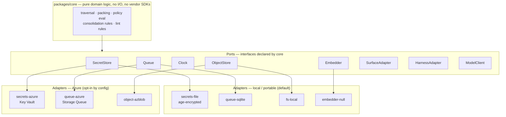
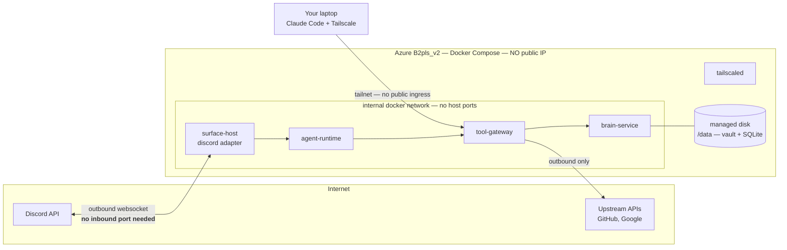

# Deployment & Portability

> Part of [`architecture/`](./README.md). Section numbers (§N) are stable across files — grep them.

## 3. Portability: ports and adapters

You want Azure but no lock-in. The answer is that **core code never names a vendor.** The host moved from AWS to Azure between revisions 3 and 4 and changed **zero lines** outside `adapters/` and `deploy/` — which is the design working as intended, not a happy accident.

**Rule enforced in CI:** a dependency-cruiser rule fails the build if `packages/core` or `packages/contracts` imports anything from `adapters/*` or any `@azure/*` package. Portability is a test, not a promise.

**For a single VM you need almost none of these.** `secrets-file`, `queue-sqlite`, and `object-fs` run fine on the box; the Azure adapters only earn their keep if you later move to managed services. Build the ports, ship the local adapters, and leave the Azure column unimplemented until something forces it.

### 3.1 Deployment targets

| Target | What runs | When |
|---|---|---|
| **Local dev** | `docker compose up` — full stack, SQLite, file secrets, fake upstream MCP servers | Phases 0–4, and every CI e2e run |
| **Azure single-host** ✅ | One `Standard_B2pls_v2` VM (2 vCPU ARM, 4 GB), Docker Compose, one managed disk, **no public IP**, Tailscale for access | **Recommended for Phase 6.** Identical compose file to local |
| **Azure managed** | Container Apps + Files + Key Vault, Bicep in `deploy/bicep/azure` | Only if you outgrow one box. You won't |
| **Any other host** | Same compose file, Hetzner/Fly/home server | Migration = `docker compose up` + restore volume |

**Recommendation: one Azure VM with Docker Compose — and don't create it until P6.** The compose file is byte-identical to what you tested locally, which is what makes migration free. Bicep is provided for the managed path but is not on the critical path.

**Drop the public IP.** Revision 3 put Caddy on a static IPv4 to terminate TLS. On Azure that is a line item (~$3.65/mo) *and* the only inbound attack surface in the whole system — and it turns out nothing needs it:

- **Discord** is an outbound websocket. Zero inbound.
- **Laptop → gateway** runs over **Tailscale** (free tier covers this comfortably). MCP over the tailnet, no certificate, no exposed port.
- **Upstream OAuth callbacks** are the only genuinely public thing — and they fire *once per upstream, ever*, during the `needs_auth` flow (§4.3). Run that leg against `localhost` on your laptop during setup; `localhost` redirect URIs are spec-legal. Nothing has to listen publicly on the VM.

That removes a cost line, a TLS certificate to renew, a Caddy container, and the entire public ingress surface. **When WhatsApp arrives it needs a real public webhook** — that is when Caddy, the static IP, and the public-edge/private-core split from revision 1 all come back. Not before.

**Migration procedure (make this a tested runbook, not a wiki page):**
1. `brain backup` → tarball of `/data` + `git push` the vault.
2. On the new host: install Docker, clone the public repo, restore `/data`, place `.env`.
3. `docker compose up -d`.
4. `brain doctor` verifies index integrity, gateway health, and upstream credential validity.

Nothing in steps 1–4 is Azure-aware. That is the whole point.

### 3.2 The Azure budget collision — read before P5

`azure/azure-config.md` documents the constraint, and it directly conflicts with the deployment above. Restating the two facts that matter:

1. **There is no hard cap.** The Azure "spending limit" — the only mechanism that actually stops billing — is unavailable on Microsoft Customer Agreement subscriptions. When the ~$1000 CAD sponsorship credit is exhausted, the subscription **silently converts to pay-as-you-go** and charges the card on file.
2. **The auto-shutdown only deallocates VMs.** Storage, networking, and any managed service keep billing after it fires.

The collision: revision 3's host (`t4g.medium` equivalent + 64 GiB disk + static IP) came to **~$42.51/mo against a 50 CAD shutdown budget — 85% of cap.** The 90% warning would fire most months, and any egress spike or snapshot would trip the 100% action and **deallocate production**. Worse, per the config's own note, the alert fires on *threshold crossing*: once tripped, restarting the VM does **not** re-arm it until the budget period resets. One bad day leaves you unprotected for the rest of the month.

**Fix it on both sides.**

*Cut the infrastructure* — the changes above take it from ~$42.51 to roughly **$36–39/mo**: drop the static IP (−$3.65), and use one 32 GiB disk instead of 64 GiB (the vault is markdown and a SQLite index — tens of megabytes, not tens of gigabytes). The 4 GB VM is the floor and stays; five Bun services plus sandboxed MCP containers (§4.6) will not fit in 2 GB.

*Re-space the budgets* so the warning fires before the guillotine. Current values put `monthly-tripwire` above `auto-shutdown-cap`, which is why the config correctly calls it dead weight — it can never fire. Suggested:

| Budget | Now | Suggested | Why |
|---|---|---|---|
| `monthly-tripwire` | 100 CAD | **55 CAD** | ~140% of steady state. Fires *first*, as an early warning that something is off |
| `auto-shutdown-cap` | 50 CAD | **90 CAD** | ~230% of steady state. Normal operation never trips it; a runaway still gets killed |
| `total-credit-cap` | 1000 CAD | unchanged | Annual credit ceiling |

The principle: **an auto-shutdown that fires during normal operation isn't a safety net, it's an outage generator.** Set it where only a genuine runaway reaches it, and put a human-readable warning below it that actually has room to fire.

**Two costs Azure budgets cannot see:**

- **OpenAI model spend** bills to OpenAI, not Azure. Set a separate usage limit in the OpenAI platform dashboard (§13).
- **The credit-exhaustion conversion.** No budget prevents it. The only real controls are watching `total-credit-cap` alerts and knowing the expiry date.

---

---

[← Index](./README.md)
