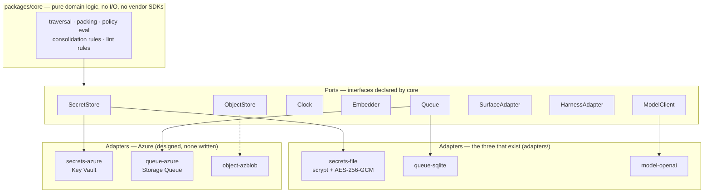
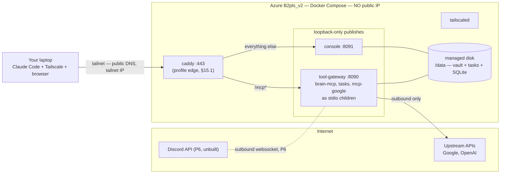

# Deployment & Portability

> Part of [`architecture/`](./README.md). Section numbers (§N) are stable across files — grep them.

## 3. Portability: ports and adapters

You want Azure but no lock-in. The answer is that **core code never names a vendor.** The host moved from AWS to Azure between revisions 3 and 4 and changed **zero lines** outside `adapters/` and `deploy/` — which is the design working as intended, not a happy accident.

*Audit note (2026-09-24):* only `secrets-file`, `queue-sqlite` and `model-openai` are written. `ObjectStore` and `Embedder` are ports with **no adapter at all** — nothing has needed a blob store, and the embedder stays null by decision #5 (§1). Earlier drafts of this chapter listed `fs-local`, `object-fs` and `embedder-null` as if they existed; they never did.

**Rule enforced in CI:** dependency-cruiser (`.dependency-cruiser.cjs`) fails the build if `packages/contracts` imports anything outside its own tree, if `packages/core` imports anything but `core` or `contracts` (or `node:crypto`), or if anything under `packages/` imports an `@azure`, `aws-sdk` or `google-cloud` SDK — stricter than "no adapters in core". Portability is a test, not a promise.

**For a single VM you need almost none of these.** `secrets-file` and `queue-sqlite` run fine on the box; the Azure adapters only earn their keep if you later move to managed services. Build the ports, ship the local adapters, and leave the Azure column unimplemented until something forces it — which, as of 2026-09-24, nothing has.

### 3.1 Deployment targets

| Target | What runs | When |
|---|---|---|
| **Local dev** | `docker compose up` — full stack, SQLite, file secrets, fake upstream MCP servers | Phases 0–4, and every CI e2e run |
| **Azure single-host** ✅ | One `Standard_B2pls_v2` VM (2 vCPU ARM, 4 GB), Docker Compose, one managed disk, **no public IP**, Tailscale for access | **Phase 5** (the roadmap settled deploy at P5, §11 — "Phase 6" here was a revision-3 leftover). Identical compose file to local |
| **Azure managed** | Container Apps + Files + Key Vault. **No Bicep exists** — `deploy/` holds `compose/`, `keycloak/` and `vm/` only; the managed path is a note, not an artifact | Only if you outgrow one box. You won't |
| **Any other host** | Same compose file, Hetzner/Fly/home server | Migration = `docker compose up` + restore volume |

**Recommendation: one Azure VM with Docker Compose — and don't create it until the stack passes locally.** The compose file is byte-identical to what you tested locally, which is what makes migration free. Bicep was planned for the managed path and never written; nothing is on that path.

**P5 implementation (2026-08-27), `deploy/compose/`:** at P5 the production stack was **one container** — the gateway over Streamable HTTP; brain-mcp is not a separate service but the gateway's stdio child, spawned per the vault's `config/servers.yaml`. **It is three services now:** the web console joined on 2026-08-28 (`console`, always on, §15) and Caddy the same day as the TLS edge (`caddy`, compose profile `edge`, production only, §15.1). The base compose file hard-requires the console's variables (`CONSOLE_BASE_URL`, `CONSOLE_CLIENT_ID`, `CONSOLE_SESSION_SECRET`, `${VAR:?}`), so a `docker compose up` with only the `GATEWAY_*` values fails at once rather than starting half a stack. `agent-runtime` and `surface-host` are still P6 and still absent. Specifics a reader should know:

- **App publishes are loopback-only** (`127.0.0.1:8090` gateway, `127.0.0.1:8091` console). At P5, `tailscale serve` on the VM fronted the gateway over the tailnet with TLS; since 2026-08-28 Caddy does that job on `443` for the real domain, and it is the one service that binds all interfaces — safe only because the VM has no public IP, so the port is reachable from the tailnet and nowhere else (§15.1). "No public ingress" is a property of the network, not of the port bindings.
- The gateway grew `GATEWAY_HOST` (bind interface; the container sets `0.0.0.0`) and `GATEWAY_RESOURCE` (the advertised PRM/challenge URL, decoupled from the bind address — the tailnet URL at P5, the console domain since the edge landed).
- The **entrypoint rebuilds `_index/brain.db` only when missing** — derived state (§5.11) is absent on a fresh volume or restored backup, but a redundant rebuild is never run (salience lives in SQLite, §5.2).
- The image (`oven/bun` pinned by digest, non-root, `--production` install) carries no `.env` and no vault — `.dockerignore` enforces the §9.1/§9.2 boundary at build time.
- `compose.dev.yaml` overlays the P4 Keycloak container as IdP; `scripts/compose-smoke.sh` runs the full stack and drives unauth 401 → PRM → authed recall → step-up 403 from inside the network. CI runs it as the §8.2 e2e tier on every PR.
- **The VM's clone is the only writer (2026-09-17).** Vault sync is one-directional: the consolidator on the VM commits, the nightly `brain-vault-push` timer pushes to the private remote, and the laptop's `vault/` is a read-only clone the owner `git pull`s to browse in Obsidian. Nothing on the laptop consolidates into it — the project-scope stdio gateway is gone (§6.4) and the SessionEnd hook delivers to the VM. Before this, the two clones met only through the remote with nothing pulling on either side; a laptop-side merge on 2026-09-02 left the VM's push rejected non-fast-forward for two weeks, failing silently every night. `deploy/vm/vault-pull.sh` stays as the recovery path for the rare laptop-side commit (the hook's local fallback when the VM is unreachable), and a rejected push is an incident, not a retry — `journalctl -u brain-vault-push` on the VM is where it shows.

*(Diagram as of 2026-09-24. The revision-5 version showed `brain-service`, `agent-runtime` and `surface-host` as compose services; brain-mcp became a stdio child instead, and the other two are P6.)*

**Drop the public IP.** Revision 3 put Caddy on a static IPv4 to terminate TLS. On Azure that is a line item (~$3.65/mo) *and* the only inbound attack surface in the whole system — and it turns out nothing needs it:

- **Discord** is an outbound websocket. Zero inbound.
- **Laptop → gateway** runs over **Tailscale** (free tier covers this comfortably). MCP over the tailnet, no certificate, no exposed port.
- **Upstream OAuth callbacks** are the only genuinely public thing — and they fire *once per upstream, ever*, during the `needs_auth` flow (§4.3). Run that leg against `localhost` on your laptop during setup; `localhost` redirect URIs are spec-legal. Nothing has to listen publicly on the VM.

That removes a cost line and the entire public ingress surface. **What came back early, and why (2026-08-28):** the web console (§15) wanted a real hostname in a browser, and a browser wants a certificate it trusts — so Caddy, a domain and a Let's Encrypt certificate returned for the console edge (§15.1) **without a public IP**: public DNS points the name at the VM's tailnet address, the certificate comes via DNS-01 (`deploy/vm/certs.sh`, lego, monthly timer), and Caddy proxies `/mcp*` to the gateway and everything else to the console. The static IP stays dropped, and so does every inbound path that is not the tailnet. **When WhatsApp arrives it needs a genuinely public webhook** — that is when the static IP and the public-edge/private-core split from revision 1 come back. Not before.

**Migration procedure (make this a tested runbook, not a wiki page):**
1. `brain backup` → tarball of `/data` + `git push` the vault.
2. On the new host: install Docker, clone the public repo, restore `/data`, place `.env`.
3. `docker compose up -d`.
4. `brain doctor` verifies the vault (path, own `.git`, parses clean) and the index (present, node count matches the vault). *That is all it checks* — gateway health is the compose healthcheck (PRM probe) plus the console's upstream-status panel (§15.4), and upstream credential validity shows up as an upstream's `auth_status` there; the broader doctor this chapter once promised was never written.

Nothing in steps 1–4 is Azure-aware. That is the whole point.

*Implemented at P5:* `brain backup [--out]` pushes the vault remote (when one exists) and tarballs the whole vault directory — **including `_index/brain.db`**, because salience and the consolidator ledger live only in SQLite (§5.2) and markdown cannot reproduce them. **`scripts/restore-drill.sh` is the runbook as a script**: backup → untar on a fresh location → compose stack up on the restored data → doctor → authed recall of the restored memory. First passed 2026-08-27 against the real vault (26 nodes recalled through the restored container stack). **Since 2026-09-18 the tarball also carries the tasks store** — `tasks/` beside `vault/`, snapshotted with `VACUUM INTO` first so a live WAL file is never captured mid-write (§16.3); the drill restores both and the stack mounts both.

*The strict VM-sourced drill also passed 2026-08-27:* backup taken **on brain-vm** (tarball + a real push through the `brain-vault-push` systemd unit), transferred laptop←VM over the tailnet via **Tailscale SSH** (enabled on the VM for ops — no run-command needed for file transfer or debugging anymore), restored on the laptop, doctor green, authed recall of the VM's memory. The drill earned its keep immediately: the first triggered push failed because **systemd units run without `HOME`**, so git couldn't see root's `safe.directory` config — the third sighting of the HOME gremlin (run-command, then the workflow wrapper, now systemd); both timers now carry `Environment=HOME=/root`.

### 3.2 The Azure budget collision — read before P5

`azure/azure-config.md` documents the constraint, and it directly conflicts with the deployment above. Restating the two facts that matter:

1. **There is no hard cap.** The Azure "spending limit" — the only mechanism that actually stops billing — is unavailable on Microsoft Customer Agreement subscriptions. When the ~$1000 CAD sponsorship credit is exhausted, the subscription **silently converts to pay-as-you-go** and charges the card on file.
2. **The auto-shutdown only deallocates VMs.** Storage, networking, and any managed service keep billing after it fires.

The collision: revision 3's host (`t4g.medium` equivalent + 64 GiB disk + static IP) came to **~$42.51/mo against a 50 CAD shutdown budget — 85% of cap.** The 90% warning would fire most months, and any egress spike or snapshot would trip the 100% action and **deallocate production**. Worse, per the config's own note, the alert fires on *threshold crossing*: once tripped, restarting the VM does **not** re-arm it until the budget period resets. One bad day leaves you unprotected for the rest of the month.

**Fix it on both sides.**

*Cut the infrastructure* — the changes above take it from ~$42.51 to roughly **$36–39/mo**: drop the static IP (−$3.65), and use one 32 GiB disk instead of 64 GiB (the vault is markdown and a SQLite index — tens of megabytes, not tens of gigabytes). The 4 GB VM is the floor and stays: the compose memory limits alone (gateway 1.5 GB with its stdio upstream children inside it, console 512 MB, Caddy 256 MB) exceed 2 GB before Docker and `tailscaled` take theirs. (Revision 5 sized this for five Bun services plus per-server sandbox containers; §4.6's sandboxes were never built and the upstreams run as children of the gateway process.)

*Re-space the budgets* so the warning fires before the guillotine. The original values put `monthly-tripwire` above `auto-shutdown-cap`, which is why the config correctly called it dead weight — it could never fire. **Done 2026-08-27**, at double the suggested values (owner: the sponsorship credit pool grew substantially, so the ladder scales with it):

| Budget | Was | Set | Why |
|---|---|---|---|
| `monthly-tripwire` | 100 CAD | **110 CAD** | ~280% of steady state. Fires *first*, as an early warning that something is off |
| `auto-shutdown-cap` | 75 CAD | **180 CAD** | ~460% of steady state. Normal operation never trips it; a runaway still gets killed |
| `total-credit-cap` | 1000 CAD | **2000 CAD** | Annual credit ceiling, raised to track the larger pool |

The action-group/webhook wiring on `auto-shutdown-cap` was carried through the update and re-verified. Ratios are looser than the 140%/230% originally suggested — deliberate: with ~2000 CAD of credit, a month of headroom costs little, and a tripwire at ~280% still warns days before the shutdown at ~460%.

The principle: **an auto-shutdown that fires during normal operation isn't a safety net, it's an outage generator.** Set it where only a genuine runaway reaches it, and put a human-readable warning below it that actually has room to fire.

**Two costs Azure budgets cannot see:**

- **OpenAI model spend** bills to OpenAI, not Azure. A separate usage limit in the OpenAI platform dashboard is the only cap — a human-only setting, listed in §13. *Set — owner confirmed 2026-08-27.*
- **The credit-exhaustion conversion.** No budget prevents it. The only real controls are watching `total-credit-cap` alerts and knowing the expiry date.

---

---

[← Index](./README.md)
