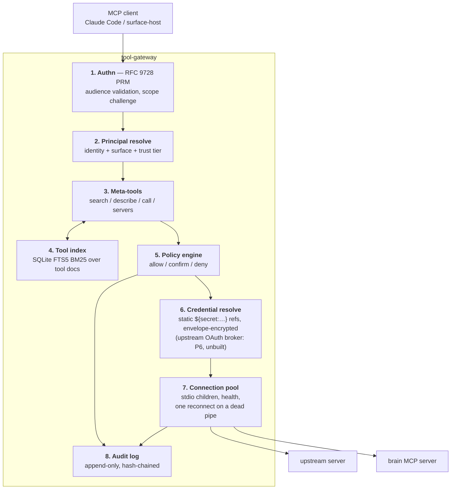

# Tool Gateway

> Part of [`architecture/`](./README.md). Section numbers (§N) are stable across files — grep them.

## 4. Component 1 — The Tool Gateway

### 4.1 What it solves

| Problem | Without a gateway |
|---|---|
| **Context bloat** | 20 MCP servers × ~20 tools × ~500 tokens ≈ **200k tokens** of schemas before you say a word |
| **Auth sprawl** | Every device holds every credential; rotation means touching six configs |
| **Name collisions** | `github.search` vs `linear.search` — model picks wrong |
| **No policy** | Discord can `delete_repo` as easily as your terminal can |
| **No audit** | Can't answer "what did the agent actually do last Tuesday" |
| **Untrusted servers** | A community MCP server runs beside your filesystem tool |

### 4.2 Internals



Note that the tool index uses **the same FTS5 BM25** as the brain. One search technology, two consumers, no model.

### 4.3 Authentication — MCP 2026-07-28

Two planes that must never cross:

- **North-bound:** who is calling the gateway. Gateway is an OAuth 2.1 **resource server** + a minimal **authorization server**.
- **South-bound:** how the gateway reaches GitHub. The design has the gateway as an OAuth **client** to each upstream; **as built, south-bound credentials are static** — refresh tokens and keys minted out of band (`scripts/google-auth.ts`, `brain secret set`) and referenced from `servers.yaml` as `${secret:name}` (§4.3 notes below). The interactive broker — `needs_auth`, consent link, `poll_token` — is P6 design and nothing emits it today.

**The hard rule, restated by the spec:** *"the MCP server **MUST NOT** pass through the token it received from the MCP client."* Inbound identity is exchanged for an outbound credential, never reused as one.

#### What changed from the 2025-06-18 revision — this matters for what you build

| Area | 2025-06-18 | **2026-07-28 (build this)** |
|---|---|---|
| Client registration | DCR (RFC 7591) **SHOULD** | **Client ID Metadata Documents SHOULD**; DCR is **deprecated**, backwards-compat only |
| `client_id` | opaque string from `/register` | an **HTTPS URL** resolving to a JSON metadata doc |
| AS metadata | RFC 8414 | RFC 8414 **or** OIDC Discovery; clients must support both |
| Issuer validation | not specified | **RFC 9207** — `iss` in authorization response, mix-up attack defence |
| Scopes | unspecified | `scope` in `WWW-Authenticate`; `403 insufficient_scope`; **step-up authorization** |
| PKCE | MUST implement | MUST implement **and verify support** via `code_challenge_methods_supported`; `S256` required |
| Refresh tokens | implied | explicit `offline_access` guidance; PR **SHOULD NOT** advertise it |

**Gateway AS requirements, concretely:**

- Advertise `client_id_metadata_document_supported: true` in AS metadata.
- On a URL-formatted `client_id`: fetch it, validate `client_id` matches the URL exactly, validate `redirect_uris`, cache per HTTP headers.
- **SSRF-harden that fetch** — HTTPS only, public-IP only (block RFC1918/link-local/metadata endpoints — `169.254.169.254` is a live credential-theft target on Azure VMs exactly as on EC2), size cap, timeout, redirect cap. This is the single highest-risk new code path in the whole system, and §8.4 makes it an explicit test target. *(Status 2026-09-01: the guard — `packages/gateway/src/ssrf.ts` — is built and table-tested, but this whole client-metadata fetch path was made moot when P4/P5 went with pre-registered IdP clients. The guard stays exported and tested, arming when a dynamic-client surface (P6/Hermes) actually fetches attacker-influenced URLs.)*
- Emit `iss` on all authorization responses and set `authorization_response_iss_parameter_supported: true`.
- Publish `code_challenge_methods_supported: ["S256"]`.
- ~~Keep DCR behind a config flag, off by default, for older clients.~~ *Option A residue: no such flag exists. The gateway is RS-only (below) and serves nothing but PRM on `/.well-known/`.*

*The sequence below is the revision-2 Option A picture, kept for the record. What is built is Option B (next subsection): the IdP serves the AS metadata and runs the interactive flow, the gateway serves only PRM, the 401 carries `resource_metadata` and no `scope=` (the `scope=` challenge is the 403's), and PLANE 2's `needs_auth` exchange does not exist — see §4.4.*

```mermaid
sequenceDiagram
    participant C as Claude Code
    participant G as Gateway (RS + AS)
    participant CIMD as Client metadata URL
    participant U as Upstream (GitHub)
    participant S as Upstream MCP server

    Note over C,G: PLANE 1 — inbound, once
    C->>G: initialize (no token)
    G-->>C: 401 WWW-Authenticate: Bearer<br/>resource_metadata=..., scope="tools:read"
    C->>G: GET /.well-known/oauth-protected-resource
    G-->>C: { authorization_servers, scopes_supported }
    C->>G: GET /.well-known/oauth-authorization-server
    G-->>C: { client_id_metadata_document_supported: true,<br/>code_challenge_methods_supported: ["S256"],<br/>authorization_response_iss_parameter_supported: true }
    Note over C: record issuer with PKCE verifier
    C->>G: authorize?client_id=https://.../client.json<br/>+ S256 challenge + resource
    G->>CIMD: GET client metadata (SSRF-guarded)
    CIMD-->>G: { client_id, client_name, redirect_uris }
    G->>G: validate client_id == URL, redirect_uri allowed
    G-->>C: code + iss
    Note over C: validate iss vs recorded (RFC 9207)
    C->>G: token request + verifier + resource
    G-->>C: access token, aud=gateway, scope="tools:read"

    Note over G,U: PLANE 2 — outbound (design; needs_auth is unbuilt)
    C->>G: tools.call("github.create_issue", {...})
    G-->>C: 403 insufficient_scope, scope="tools:write"
    Note over C: step-up — re-authorize with<br/>union of old and new scopes
    C->>G: tools.call retry (scope now tools:write)
    G->>G: no GitHub credential yet
    G-->>C: { needs_auth, auth_url, poll_token }
    Note over C: agent shows link in Discord / terminal
    C->>U: user consents in browser
    U->>G: /oauth/callback?code=...
    G->>U: exchange for upstream tokens
    G->>G: envelope-encrypt, store by (principal, upstream)
    C->>G: tools.call retry with poll_token
    G->>S: call with UPSTREAM token — never the inbound one
    S-->>G: result
    G-->>C: result, tagged untrusted-content
```

**Scope tiers map onto risk**, so step-up authorization becomes a real security boundary rather than ceremony:

| Scope | Grants |
|---|---|
| `brain:read` | `brain.recall`, `expand`, `neighbors`, `trace`, `timeline` |
| `brain:write` | `brain.note`, `brain.pin`, `brain.ingest` |
| `tools:read` | any upstream tool classified `read` |
| `tools:write` | any upstream tool classified `write` — including ordinary filesystem writes |
| `tools:admin` | tools classified `admin`: `destructiveHint`, or delete/exec/shell-style names, or a config override |

The mapping is by *kind*, not by name (`requiredScope` in `auth.ts`): `brain.*` → `brain:read`/`brain:write`, everything else → `tools:<kind>`, with kind from §4.4's classification order. A session holds whatever scopes its client asked for and the IdP granted — the gateway does not impose or advertise a starting scope (the 401 carries only `resource_metadata`); escalation shows up as the 403 `scope=` challenge and the client's re-authorization.

#### Scopes vs. the policy engine — precedence must be explicit

There are now **two authorization systems** (OAuth scopes here, the policy engine in §4.5) and they can disagree. Left unstated, that's ambiguous at implementation time. The rule:

1. **Scopes are checked first**, at the protocol layer. Insufficient scope → `403 insufficient_scope`, which triggers step-up. Scopes grant *coarse capability classes* and nothing finer.
2. **Policy is evaluated second**, and **can only narrow, never widen.** A `tools:write` token does not override a policy `deny`; a policy `allow` does not substitute for a missing scope.
3. The two denials are distinguishable — but not in the audit log. A scope failure is answered at the HTTP layer as `403 insufficient_scope` *before* the meta layer runs, so it is never audited; only policy decisions (`decision` events) reach the chain. Scope failures are recoverable by re-authorizing, policy failures are not.

Think of scopes as "what this *session* may ever do" and policy as "what this *call*, with these arguments, from this surface, may do right now."

#### Should you write the authorization server at all?

Revision 2 assumed you build a minimal AS inside the gateway. **Reconsider this** — it's the largest and riskiest slice of P4:

| | **Option A — self-hosted AS** (rev 2) | **Option B — hosted IdP as AS** ✅ |
|---|---|---|
| You build | RS + AS + CIMD fetch + `iss` emission + consent | **RS only** |
| Riskiest code | CIMD fetch: an attacker-controlled outbound request from the box holding every credential, on any cloud VM, where `169.254.169.254` is live | none — you never fetch attacker-supplied URLs |
| Client registration | you implement CIMD, DCR fallback | IdP's DCR, which Claude Code supports as fallback |
| Effort | ~4 days, spec-compliance risk | ~1 day |
| Cost | £0 | £0 at Auth0/Clerk free tier for one user |
| Trade-off | full control, no third party | an external dependency in your auth path |

**Recommendation: Option B.** The gateway stays a **resource server** — it publishes RFC 9728 protected resource metadata, validates audience and scopes, and issues `WWW-Authenticate` challenges. All of that is required either way and is the part that makes stock MCP clients work. What you delete is an entire OAuth 2.1 authorization server *and* the single highest-risk code path in the system.

The self-hosted path stays documented because it's a one-package swap later — the RS is identical in both. Take Option A only if depending on an external IdP for your own tools is unacceptable to you. This is question 6 in §12 — *resolved (owner, 2026-08-25): P4 runs the IdP as a local Keycloak container (zero signup, fully local like the rest of P0–P4); a hosted IdP takes over at P5 by changing the issuer URL. The gateway code is the same RS in all three worlds.*

**Secret storage.** Refresh tokens are envelope-encrypted: a per-record data key wrapped by a master key that never sits in the database. `secrets-file` uses Bun's `node:crypto` (scrypt-derived master key, AES-256-GCM per record) with the key file at `0600` — **no external binary, so nothing extra to install** (§13). It is the only implementation of the `SecretStore` port and is wired directly in `server.ts` — a Key Vault adapter would be a one-package addition behind the same port, but nothing selects one by config today.

P4 implementation notes (`packages/gateway` auth + `adapters/secrets-file`), all verified live against a local Keycloak container and deterministically against a mock AS in CI:

- **RS role, not AS.** `TokenVerifier` (jose) validates `iss`/`aud`/`exp`/signature against the IdP's JWKS; `/.well-known/oauth-protected-resource` serves RFC 9728 PRM; a missing/invalid token is 401 with a `resource_metadata` challenge, insufficient scope is 403 with a `scope="…"` challenge. The four wrong-token cases (expired, wrong aud, wrong iss, wrong key) each 401 — table-tested (§8.4).
- **Scope tiers enforced at the HTTP layer, above policy.** `tools/call` pre-checks `requiredScope(urn, kind)` (brain.* → `brain:read`/`brain:write`, else `tools:<kind>`) before any policy/upstream work — that's what makes step-up a real boundary. Policy still composes underneath and can only narrow (§4.5).
- **Token passthrough is structurally prevented (§8.4).** Verified inbound tokens are used for verification only; identity flows via the SDK's per-request `authInfo` channel (race-free), never the token itself. An integration test dumps a fake upstream's entire env+argv and asserts the token appears in neither it nor the audit log.
- **Env scrubbing (§7).** A real gap surfaced and closed: bun auto-loads `.env` from a child's cwd, so an upstream spawned in the repo root would inherit the gateway's `OPENAI_API_KEY`. Upstreams now get only `getDefaultEnvironment()` + their declared `env:`, spawned in a neutral cwd with script args pre-resolved to absolute — the test asserts `OPENAI_API_KEY` is absent from the upstream's world.
- **Relative paths never cross the spawn boundary (2026-09-01 incident).** The neutral cwd has a sharp edge the original fix missed: script *args* were pre-resolved to absolute, but *env values* expanded via `${VAR}` were not — so `.mcp.json`'s relative `BRAIN_VAULT_PATH=./vault` (relative because the file is committed to a public repo) reached the brain upstream verbatim and resolved against `tmpdir()`. Result: a **shadow vault in the OS temp directory** silently accepted five days of memory writes, unversioned (the consolidator's git-commit step read a failed `git status`'s empty stdout as "clean" — also fixed, it now throws), until macOS temp cleanup started deleting node files. Everything was recovered from the shadow's surviving SQLite index (`scripts/vault-from-index.ts` is the db→markdown disaster tool this produced). The fix: both gateway mains absolutize `BRAIN_VAULT_PATH` against their own cwd **before** `${VAR}` expansion and log the resolved path at startup. The rule generalizes: anything that crosses into a neutral-cwd child must be absolute by then. The laptop-side gateway that took these writes was retired on 2026-09-17 — one gateway, the deployed one, from every directory (§6.4).
- **Two credential planes, never crossing.** North-bound = local Keycloak (`brain-cli` public+PKCE, `agent-runtime` confidential+`client_credentials`); south-bound = upstream credentials as envelope-encrypted `${secret:name}` refs resolved at spawn (`brain secret set|list|rm`). An unresolved ref is a hard error, never an empty string handed upstream.
- **SSRF guard: built, tested, deliberately not wired.** `ssrf.ts` blocks RFC1918/loopback/link-local and `169.254.169.254` and is table-tested (§8.4), but nothing imports it: Option B removed the only attacker-influenced fetch, and the JWKS/discovery fetch in `auth.ts` is a bare `fetch` against the operator-configured issuer. Owner decision (2026-09-01): keep it exported and tested, arm it the day a dynamic-fetch consumer exists (P6). Until then it guards nothing, and this document should not be read as saying otherwise.
- **Transport:** Streamable HTTP with a fresh MCP `Server` per session (the SDK Protocol binds one transport at a time). stdio (P3) stays unauthenticated with the static local identity.

### 4.4 Progressive tool disclosure

Four tools advertised instead of four hundred:

```
tools.search(query, limit?, kind?)  -> [{ urn, title, one_line, server, score, auth_status }]
tools.describe(urns[])              -> [{ urn, description, input_schema, risk }]   (examples: in the contract, never populated)
tools.call(urn, args, confirm_token?)
     -> result
      | { needs_confirm: true, confirm_token, preview, risk }
      | { needs_auth: true, auth_url, poll_token }   (P6 design — never emitted today, §4.3)
tools.servers()                     -> [{ name, status, tool_count, auth_status, last_error }]
```

Base cost **298 tokens** (measured, all four schemas) instead of ~200k.


Every tool gets a stable URN `<server>.<tool>` — **two segments**, the server's `servers.yaml` name and the tool's own name (`brain.recall`, `g-2006.mail_search`, `tasks.due`); there is no namespace segment. Collisions become impossible, and URNs are stable enough to reference from policy rules (`brain.*`, `*.send_*`) and brain nodes.

P3 implementation notes (`packages/gateway`): the wire tool names are `tools_search` / `tools_describe` / `tools_call` / `tools_servers` — the tool-name charset is `[a-zA-Z0-9_-]`, so the dotted names above are conceptual. Measured base context: **298 tokens** for all four (budget said <1k). Array results wrap as `{results: […]}` because MCP `structuredContent` must be an object. Risk classification authority order: config override → MCP tool annotations (`readOnlyHint`/`destructiveHint`) → name heuristic → `write` (confirm-default makes the fallback safe). Confirm tokens are single-use, bound to the URN and `sha256(args)`, 5-minute TTL. The audit log is hash-chained JSONL at `vault/_index/audit.jsonl` storing arg *digests*, never values; call/error events also stamp the upstream duration as `ms` (W1.7 — feeds the console's analytics panel, §15.4). A 120/min sliding-window rate cap guards the runaway-agent case (§7) — one window per gateway process, shared by every principal (the error text says "per principal", which for one user is the same thing; a real per-principal map is a small change if a second principal ever appears). There is no spend cap and no circuit breaker: a dead upstream is marked down and reconnected once on the next call. Identity is static (`owner`/`cli`/`high`) until P4 derives it from authn.

Naming (2026-08-28): the gateway is **`tool-gateway`** everywhere — the MCP client registration, server/client display names, the GHCR image (`ghcr.io/mars-flat/tool-gateway`), the dev audience default (code fallback + Keycloak dev realm), and the harness delivery env (`TOOL_GATEWAY_URL`). The earlier `brain-gateway` misread this section: the brain MCP server is one upstream behind the pool, not the gateway's identity. The production OAuth audience needed no rename — it is the canonical MCP resource URL (RFC 8707), not a bare name; the leftover bare-name Auth0 API from before that migration was deleted with the rename. `BRAIN_HOOK_*` names the hook's credential, not the gateway, and stays.

### 4.5 Policy engine

```yaml
# <vault>/config/policy.yaml — first match wins. Lives in the private vault, never this repo.
- match: { tool: "brain.*", kind: read }
  effect: allow

- match: { surface: ["discord"], kind: write }
  effect: confirm
  reason: "medium-trust surface, write operation"

- match: { surface: ["discord"], tool: ["shell.*", "fs.write", "*.delete_*"] }
  effect: deny

- match: { kind: read }
  effect: allow

- default: confirm
```

**Default is `confirm`, not `deny`** — a deny-default personal system is one you route around within a week. Confirm-default keeps you in the loop without blocking.

The P0 contract (`packages/contracts/policy.schema.json`) pins this down: match keys are `tool`, `kind`, `surface`, `principal`, `trust` (scalar or list); exactly one `default` rule is required and it must be **last**, since under first-match-wins anything after it is dead.

### 4.6 Untrusted upstream servers

**As built:** every upstream is a stdio child of the single gateway process, inside the one gateway container — which mounts the vault. The isolation that exists is at the process boundary: a scrubbed environment (SDK defaults plus the server's declared `env:` only), a neutral cwd with no `.env`, script args and `${secret:…}` refs pre-resolved so nothing crosses the spawn relative or unresolved, the container-level `mem_limit`, and results wrapped in an untrusted-content marker so the model treats them as data rather than instruction. Prompt injection via tool output is the realistic attack (§7), and the wrapper plus confirm-default policy is the mitigation.

**Design, unbuilt:** per-server containers with no host mounts, an egress allowlist, and per-server memory/CPU caps. Nothing in the roster today is a community server — brain, tasks, and the in-house Google servers are all this repo's code — so the container-per-upstream cost was not paid. Revisit before the first third-party server is added to `servers.yaml`; until then a malicious upstream would run beside the vault, and §7's threat table says so.

---

---

[← Index](./README.md)
