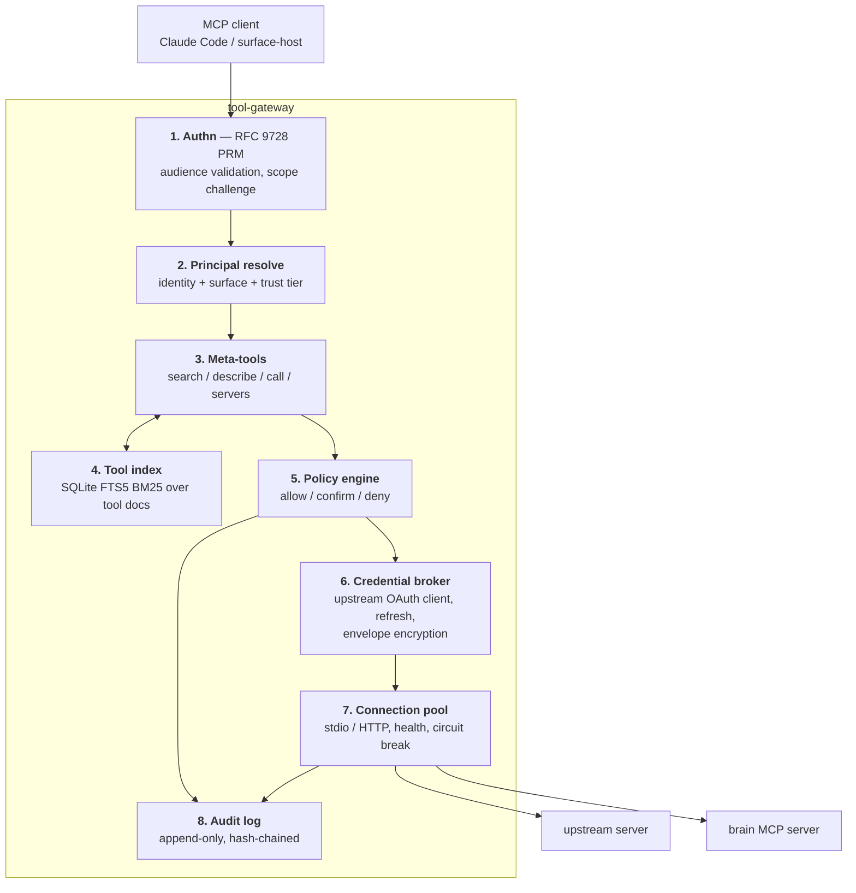
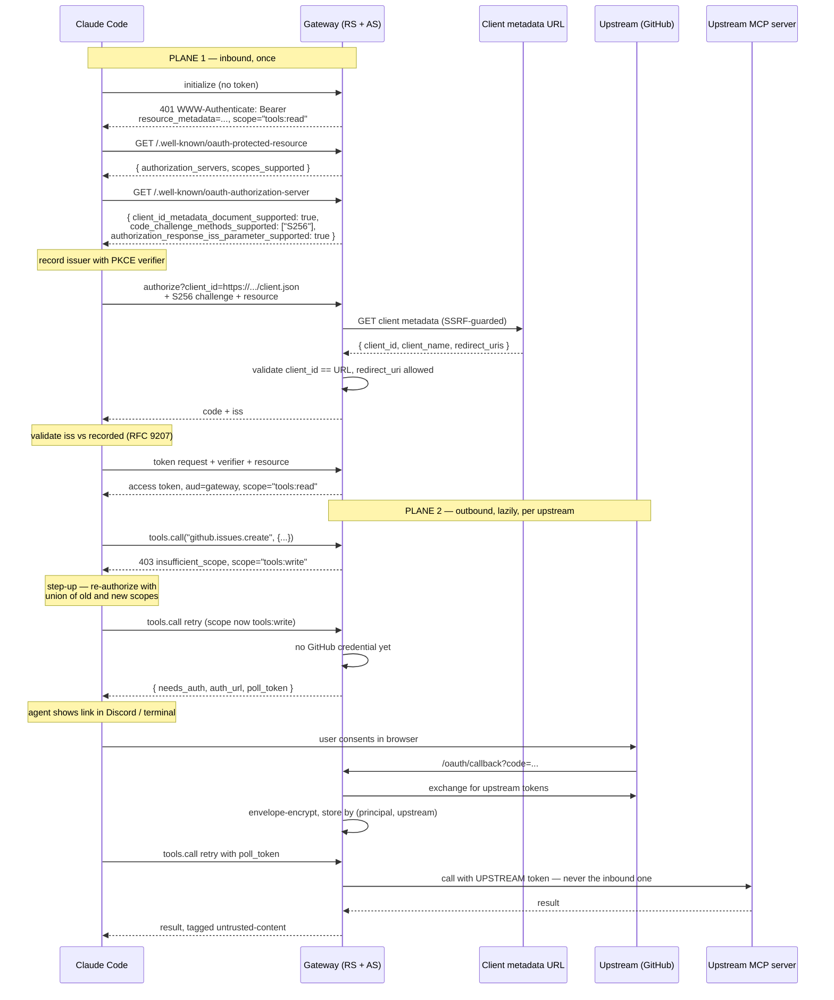
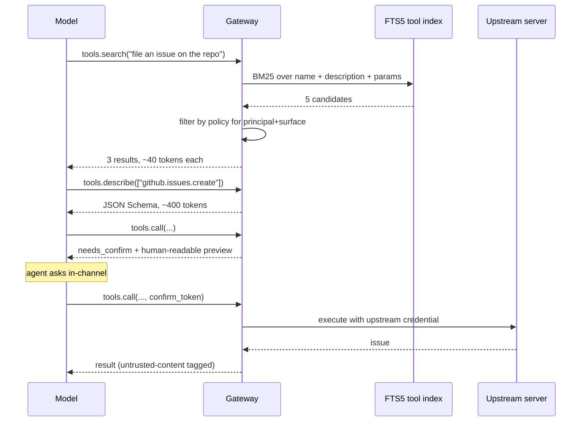

# Tool Gateway

> Part of [`architecture/`](./README.md). Section numbers (§N) are stable across files — grep them.

## 4. Component 1 — The Tool Gateway

### 4.1 What it solves

| Problem | Without a gateway |
|---|---|
| **Context bloat** | 20 MCP servers × ~20 tools × ~500 tokens ≈ **200k tokens** of schemas before you say a word |
| **Auth sprawl** | Every device holds every credential; rotation means touching six configs |
| **Name collisions** | `github.search` vs `linear.search` — model picks wrong |
| **No policy** | Discord can `delete_repo` as easily as your terminal can |
| **No audit** | Can't answer "what did the agent actually do last Tuesday" |
| **Untrusted servers** | A community MCP server runs beside your filesystem tool |

### 4.2 Internals



Note that the tool index uses **the same FTS5 BM25** as the brain. One search technology, two consumers, no model.

### 4.3 Authentication — MCP 2026-07-28

Two planes that must never cross:

- **North-bound:** who is calling the gateway. Gateway is an OAuth 2.1 **resource server** + a minimal **authorization server**.
- **South-bound:** how the gateway reaches GitHub. Gateway is an OAuth **client** to each upstream.

**The hard rule, restated by the spec:** *"the MCP server **MUST NOT** pass through the token it received from the MCP client."* Inbound identity is exchanged for an outbound credential, never reused as one.

#### What changed from the 2025-06-18 revision — this matters for what you build

| Area | 2025-06-18 | **2026-07-28 (build this)** |
|---|---|---|
| Client registration | DCR (RFC 7591) **SHOULD** | **Client ID Metadata Documents SHOULD**; DCR is **deprecated**, backwards-compat only |
| `client_id` | opaque string from `/register` | an **HTTPS URL** resolving to a JSON metadata doc |
| AS metadata | RFC 8414 | RFC 8414 **or** OIDC Discovery; clients must support both |
| Issuer validation | not specified | **RFC 9207** — `iss` in authorization response, mix-up attack defence |
| Scopes | unspecified | `scope` in `WWW-Authenticate`; `403 insufficient_scope`; **step-up authorization** |
| PKCE | MUST implement | MUST implement **and verify support** via `code_challenge_methods_supported`; `S256` required |
| Refresh tokens | implied | explicit `offline_access` guidance; PR **SHOULD NOT** advertise it |

**Gateway AS requirements, concretely:**

- Advertise `client_id_metadata_document_supported: true` in AS metadata.
- On a URL-formatted `client_id`: fetch it, validate `client_id` matches the URL exactly, validate `redirect_uris`, cache per HTTP headers.
- **SSRF-harden that fetch** — HTTPS only, public-IP only (block RFC1918/link-local/metadata endpoints — `169.254.169.254` is a live credential-theft target on Azure VMs exactly as on EC2), size cap, timeout, redirect cap. This is the single highest-risk new code path in the whole system, and §8.4 makes it an explicit test target.
- Emit `iss` on all authorization responses and set `authorization_response_iss_parameter_supported: true`.
- Publish `code_challenge_methods_supported: ["S256"]`.
- Keep DCR behind a config flag, off by default, for older clients.



**Scope tiers map onto risk**, so step-up authorization becomes a real security boundary rather than ceremony:

| Scope | Grants |
|---|---|
| `brain:read` | `brain.recall`, `expand`, `neighbors`, `trace` |
| `brain:write` | `brain.note`, `brain.pin` |
| `tools:read` | any upstream tool marked read-only |
| `tools:write` | any upstream tool that mutates |
| `tools:admin` | shell, filesystem write, destructive operations |

A session starts at `brain:read tools:read`. Escalation is a visible, logged event.

#### Scopes vs. the policy engine — precedence must be explicit

There are now **two authorization systems** (OAuth scopes here, the policy engine in §4.5) and they can disagree. Left unstated, that's ambiguous at implementation time. The rule:

1. **Scopes are checked first**, at the protocol layer. Insufficient scope → `403 insufficient_scope`, which triggers step-up. Scopes grant *coarse capability classes* and nothing finer.
2. **Policy is evaluated second**, and **can only narrow, never widen.** A `tools:write` token does not override a policy `deny`; a policy `allow` does not substitute for a missing scope.
3. Denials from each layer are distinguishable in the audit log — scope failures are recoverable by re-authorizing, policy failures are not.

Think of scopes as "what this *session* may ever do" and policy as "what this *call*, with these arguments, from this surface, may do right now."

#### Should you write the authorization server at all?

Revision 2 assumed you build a minimal AS inside the gateway. **Reconsider this** — it's the largest and riskiest slice of P4:

| | **Option A — self-hosted AS** (rev 2) | **Option B — hosted IdP as AS** ✅ |
|---|---|---|
| You build | RS + AS + CIMD fetch + `iss` emission + consent | **RS only** |
| Riskiest code | CIMD fetch: an attacker-controlled outbound request from the box holding every credential, on any cloud VM, where `169.254.169.254` is live | none — you never fetch attacker-supplied URLs |
| Client registration | you implement CIMD, DCR fallback | IdP's DCR, which Claude Code supports as fallback |
| Effort | ~4 days, spec-compliance risk | ~1 day |
| Cost | £0 | £0 at Auth0/Clerk free tier for one user |
| Trade-off | full control, no third party | an external dependency in your auth path |

**Recommendation: Option B.** The gateway stays a **resource server** — it publishes RFC 9728 protected resource metadata, validates audience and scopes, and issues `WWW-Authenticate` challenges. All of that is required either way and is the part that makes stock MCP clients work. What you delete is an entire OAuth 2.1 authorization server *and* the single highest-risk code path in the system.

The self-hosted path stays documented because it's a one-package swap later — the RS is identical in both. Take Option A only if depending on an external IdP for your own tools is unacceptable to you. This is question 6 in §12 — *resolved (owner, 2026-08-25): P4 runs the IdP as a local Keycloak container (zero signup, fully local like the rest of P0–P4); a hosted IdP takes over at P5 by changing the issuer URL. The gateway code is the same RS in all three worlds.*

**Secret storage.** Refresh tokens are envelope-encrypted: a per-record data key wrapped by a master key that never sits in the database. `secrets-file` uses Bun's `node:crypto` (scrypt-derived master key, AES-256-GCM per record) with the key file at `0600` — **no external binary, so nothing extra to install** (§13). `secrets-azure` uses Key Vault. Same interface, chosen by config.

### 4.4 Progressive tool disclosure

Four tools advertised instead of four hundred:

```
tools.search(query, limit?, kind?)  -> [{ urn, title, one_line, server, score, auth_status }]
tools.describe(urns[])              -> [{ urn, description, input_schema, examples, risk }]
tools.call(urn, args, confirm_token?)
     -> result
      | { needs_auth: true, auth_url, poll_token }
      | { needs_confirm: true, confirm_token, preview, risk }
tools.servers()                     -> [{ name, status, tool_count, auth_status, last_error }]
```

Base cost **~800 tokens** instead of ~200k.



Every tool gets a stable URN `<server>.<namespace>.<tool>`. Collisions become impossible, and URNs are stable enough to reference from policy rules and brain nodes.

P3 implementation notes (`packages/gateway`): the wire tool names are `tools_search` / `tools_describe` / `tools_call` / `tools_servers` — the tool-name charset is `[a-zA-Z0-9_-]`, so the dotted names above are conceptual. Measured base context: **298 tokens** for all four (budget said <1k). Array results wrap as `{results: […]}` because MCP `structuredContent` must be an object. Risk classification authority order: config override → MCP tool annotations (`readOnlyHint`/`destructiveHint`) → name heuristic → `write` (confirm-default makes the fallback safe). Confirm tokens are single-use, bound to `sha256(urn+args)`, 5-minute TTL. The audit log is hash-chained JSONL at `vault/_index/audit.jsonl` storing arg *digests*, never values. A 120/min sliding-window rate cap guards the runaway-agent case (§7). Identity is static (`owner`/`cli`/`high`) until P4 derives it from authn.

### 4.5 Policy engine

```yaml
# config/policy.yaml — first match wins. NOT committed to the public repo.
- match: { tool: "brain.*", kind: read }
  effect: allow

- match: { surface: ["discord"], kind: write }
  effect: confirm
  reason: "medium-trust surface, write operation"

- match: { surface: ["discord"], tool: ["shell.*", "fs.write", "*.delete_*"] }
  effect: deny

- match: { kind: read }
  effect: allow

- default: confirm
```

**Default is `confirm`, not `deny`** — a deny-default personal system is one you route around within a week. Confirm-default keeps you in the loop without blocking.

The P0 contract (`packages/contracts/policy.schema.json`) pins this down: match keys are `tool`, `kind`, `surface`, `principal`, `trust` (scalar or list); exactly one `default` rule is required and it must be **last**, since under first-match-wins anything after it is dead.

### 4.6 Untrusted upstream servers

Each community MCP server runs in its own container: no host mounts, egress allowlist, memory and CPU caps. Their results are wrapped in an untrusted-content marker so the model treats them as data rather than instruction. Prompt injection via tool output is the realistic attack (§7).

---

---

[← Index](./README.md)
