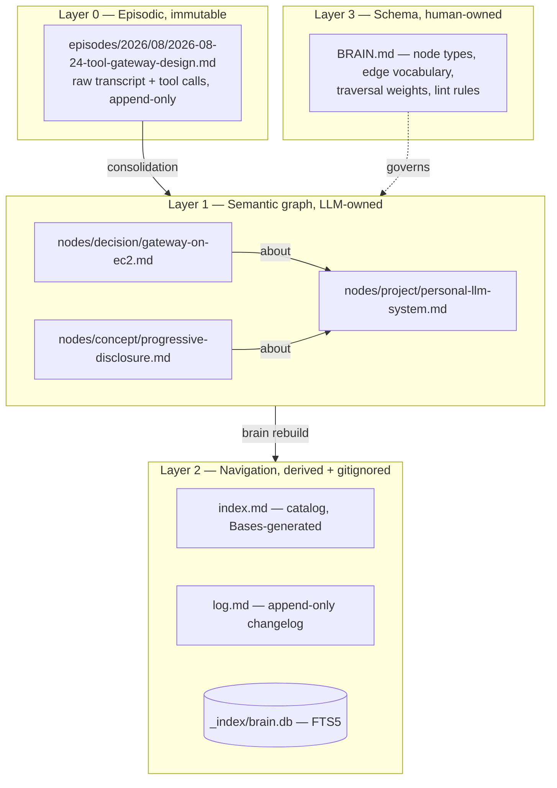
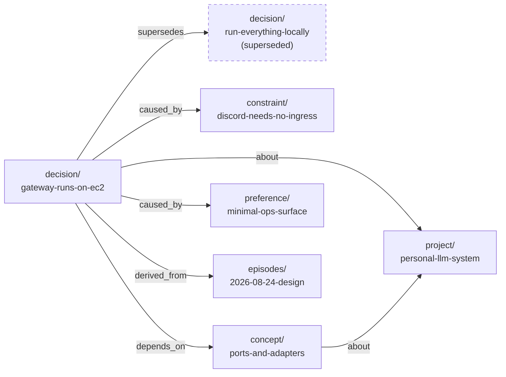

# The Brain — Data Model

> Part of [`architecture/`](./README.md). Section numbers (§N) are stable across files — grep them.

## 5. Component 2 — The Brain

An llm-wiki that ingests chat transcripts automatically and retrieves by graph traversal under a token budget. **The vault is a real Obsidian vault** — you can open it, read it, edit it, and see the graph, with no software of ours running.

### 5.1 Layers



Layer 0 is truth-of-record; Layer 1 is *interpretation* and can be regenerated if the schema improves; Layer 2 is a pure cache, rebuilt in seconds and **never committed**; Layer 3 is the only file you hand-write.

### 5.2 A node is an Obsidian note

```markdown
---
id: gateway-runs-on-ec2
type: decision
title: Tool gateway runs on one Azure VM with Docker Compose
aliases: ["where does the gateway run", "hosting decision", "deployment target"]
tags: [architecture, infra]
created: 2026-08-24
updated: 2026-08-24
status: active
confidence: high
provenance: trusted
sources: ["[[2026-08-24-tool-gateway-design]]"]

caused_by:  ["[[discord-needs-no-ingress]]", "[[minimal-ops-surface]]"]
depends_on: ["[[ports-and-adapters]]"]
about:      ["[[personal-llm-system]]"]
supersedes: ["[[run-everything-locally]]"]

summary: >
  A single Azure B2pls_v2 running Docker Compose. Uses existing sponsorship credit
  while keeping the deploy unit vendor-neutral — the compose file is identical
  to local dev, so migration to any Docker host is a volume restore.
---

## Detail

Full reasoning, alternatives considered, rejected options. This is the `full`
render tier.

## Links
- caused_by → [[discord-needs-no-ingress]], [[minimal-ops-surface]]
- supersedes → [[run-everything-locally]]
```

Four things to note:

- **Typed edges are Obsidian properties.** Each relation is a list property of quoted wikilinks. Obsidian supports internal links in properties, including list properties — **the quotes are mandatory**, `["[[note]]"]` not `[[[note]]]`. So one representation serves both Obsidian and the traversal engine.

- **Links are bare basenames, and `id` equals the basename.** This is not cosmetic. Obsidian's link autocomplete inserts the **shortest unambiguous form** — typing `[[` and picking this note yields `[[gateway-runs-on-ec2]]`, *not* `[[decision/gateway-runs-on-ec2]]`. If the parser expected path-form links, every link you create by hand in Obsidian would fail to resolve. So:
  - **Node ids are globally unique basenames** across the whole vault. Type lives in the `type:` property and in the folder for organization only — it is never part of the identifier.
  - The resolver matches by basename, then by alias, exactly as Obsidian does.
  - **Lint enforces basename uniqueness** — a collision is a hard error, because it would make links ambiguous for both Obsidian and the resolver.
  - `.obsidian/app.json` pins `"newLinkFormat": "shortest"` and `"useMarkdownLinks": false` so the app and the parser always agree.

- **`salience` is *not* in frontmatter — it lives only in SQLite.** It's bumped on every full-tier render (§5.5), so storing it in the note would make **every read a write**: git churn on each query, and a second writer racing the single-writer consolidator (§5.7). Derived, mutable, high-frequency values stay in the index; the markdown holds only what a human would want to read and edit.

- **The `## Links` body block is a lint-maintained mirror.** Obsidian's docs do not state whether property links appear in graph view and backlinks. Rather than bet the design on unverified behaviour, the body block guarantees graph-view edges and backlinks regardless. **P0 spike: check whether property links show in graph view; if they do, make the mirror optional.** Frontmatter stays authoritative for traversal either way.

**Node types:** `project` · `decision` · `concept` · `entity` · `person` · `preference` · `constraint` · `artifact` · `event`.

The `summary` field is load-bearing — it's the middle render tier, so it must stand alone at ~100–150 tokens.

### 5.3 Edge vocabulary

A **closed** set, so traversal can weight by relation type. Weight is a property of the *relation*, not the individual edge — fewer knobs, and it fits Obsidian's list properties cleanly.

| Relation | Meaning | Decay δ | Special rule |
|---|---|---|---|
| `supersedes` | replaces an older node | **1.0** | **Always followed to terminal node** |
| `contradicts` | conflicts with | **1.0** | **Always pulled in if either endpoint included** |
| `caused_by` | exists because of | 0.85 | — |
| `depends_on` | requires | 0.80 | — |
| `part_of` | component of | 0.75 | — |
| `about` | topically concerns | 0.60 | — |
| `example_of` | instance of | 0.60 | — |
| `authored_by` | attribution | 0.50 | — |
| `derived_from` | provenance to episode | 0.40 | — |
| `mentioned_with` | weak co-occurrence | 0.30 | Pruned first under budget pressure |

The two bold rules are the correctness guarantees of the entire memory system:

1. **You can never be served a superseded decision without its replacement.** `supersedes` chains are followed to the end, unconditionally, ignoring budget.
2. **You can never be served one side of a contradiction silently.** If a disputed node is included, its counterpart comes too, and the pack labels the conflict.

Without these, a memory system confidently hands you last month's answer. With them, it hands you the current answer and shows its work. Both are enforced as **property-based tests** (§8.3), not merely intended.

Inverse edges (`superseded_by`, `causes`, …) are **derived into SQLite at index time**, never written to disk. One direction on disk, both directions in the index.

Two notational details fixed at P0: episode files are named with the **full date in the basename** (`episodes/2026/08/2026-08-24-tool-gateway-design.md`) — date-sharded folders alone would let basenames collide across months, and basenames are the identifier. And `sources:` frontmatter is the canonical provenance notation — the indexer materializes each entry as a `derived_from` edge, so notes rarely write `derived_from` explicitly.

### 5.4 Example subgraph



A query hitting `D1` on one literal word picks up, in one hop, the constraint that forced it, the preference that shaped it, and the superseded alternative — labeled. **That neighbourhood is the answer.** Flat search returns three disconnected paragraphs and leaves you to reassemble the reasoning.

### 5.11 Storage

- **Source of truth:** Obsidian vault, its own local git repo (§9.1). Human-editable, diffable, portable, and openable on your phone.
- **Derived index:** one SQLite file at `_index/brain.db` — `nodes`, `edges`, `episodes`, `pins`, `salience`, plus `nodes_fts` (FTS5, `porter` tokenizer). **Gitignored**, rebuilt by `brain rebuild`.
- **Scale:** a heavy year is O(10⁴) nodes, O(10⁵) edges. SQLite does 3-hop traversal on that in single-digit milliseconds.
- **Do not** reach for Neo4j, a hosted vector DB, or Postgres.

---

---

[← Index](./README.md)
