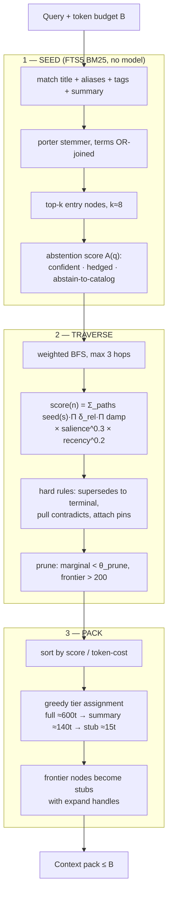
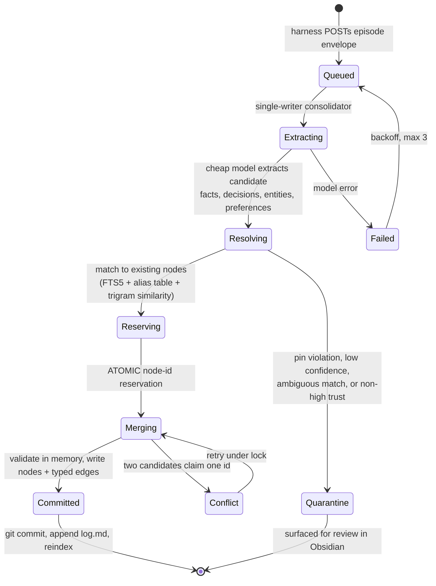

# The Brain — Retrieval & Writes

> Part of [`architecture/`](./README.md). Section numbers (§N) are stable across files — grep them.

### 5.5 Retrieval — seed, traverse, pack (no model anywhere)



**Tiering is the whole trick.** A node is never dropped for scoring low — it is **downgraded**. The top-3 **eligible** nodes render full, ranks 4–12 as summaries, and everything below as one-line stubs — there is no stub cap short of the budget itself. Every stub carries its id, so the model can call `brain.expand(["x"])` mid-conversation and promote exactly what it needs. Ids are **bare basenames** (§5.2): the pack prints `decision/x` as a label, but `expand` resolves `x`, and a `type/id` handle lands in the result's `missing` list.

**Full slots are query-anchored** (added 2026-08-31, from the paraphrase
suite's findings): a node may hold a full slot only if it was a seed, within
1 hop of one, or pinned — hubs that qualify purely via long-path
accumulation share a single full slot. Ranking decides who is *in* the pack;
eligibility decides who gets the expensive tiers. Once every eligible node
is full and budget still remains, the restriction lifts (scarcity is the
thing being protected), so a five-node graph with a 4k budget still renders
everything full.

Three details pinned at P1 (the implementation is in `packages/core`): the rank bands are **minimums** — leftover budget upgrades nodes in rank order, so a five-node graph with a 4k budget renders everything full; when even all-stubs exceeds the budget, the tail is omitted **explicitly** (counted in the pack footer with the first few ids; the full list rides in `result.omitted`), never silently — the footer listing is capped because an unbounded one made omission move a node's cost into the footer instead of freeing it, emptying packs on long-id vaults at small budgets (fixed 2026-09-01); and token costs are `ceil(chars/4)` — deterministic and dependency-free, which is what the budget invariant actually needs, since §5.5's tier sizes were always approximations.

The agent always knows the *shape* of what it knows at ~15 tokens per fact, and pays full price only for what it reads. This is the same progressive-disclosure pattern as `tools.search → tools.describe`, applied to memory instead of capability.

```
score(n) = Σ over paths s→n [ bm25_norm(s) · Π_{e∈path} δ_rel(e) · Π_{m∈path} damp(m) ]
           · salience(n)^0.3 · recency(n)^0.2

damp(m) = (1 + degree(m) / medianDegree)^-α        α = 0.5
```

**The damp term** (added 2026-08-31): Σ-over-paths is a funnel — every path
in a dense graph flows through the high-degree nodes, so the same hubs
outscored query-relevant nodes on *every* query (measured: one hub took a
full slot on 2 of 3 unrelated real-vault queries). Each node a path arrives
at damps the mass by its connectivity relative to the vault's own median
degree — the PageRank intuition applied to the funnel. Degree stats are
computed per-recall from the graph slice (pure, cheap, nothing stored);
"hub" means degree ≥ max(4, p95) *of this vault*, so nothing rots as the
graph grows. α = 0 recovers undamped scoring exactly. The draft's companion
idea — capping Σ at one path per seed — is **not built**: damping alone
moved the eval numbers, and the cap would have killed legitimate
multi-path corroboration along with the funnel.

`salience` is a usage counter with exponential decay, bumped when the model **`brain.expand`s a node** — explicit demand — never when a node merely renders. It lives **only in SQLite**, never in the note (§5.2). `recency = exp(-age_days / 180)`. The exponents are deliberately gentle: relevance dominates, recency breaks ties. **All of these are starting values to tune against the eval set in §8.5.** *(Changed 2026-08-31: the original bump-on-full-render was a rich-get-richer loop with no relevance signal in it — hub nodes rendered full because of salience earned by rendering full, which the paraphrase suite caught as hubs squatting the full tier on unrelated queries. Recall is now a pure read.)*

One seed-stage correction from P1 stands: **prefix queries were dropped** — porter stems the index, so a prefix star on a full word (`training*`) *misses* its own stem (`train`); plain OR-joined terms with porter on both sides is strictly better.

**The abstention gate** (2026-08-31; supersedes the P1 scalar θ_seed). The
adversarial suite (§8.5) showed θ_seed's bands overlap in both directions —
obscurely-phrased real questions topped out at 4.2–4.6 raw (starved) while a
topically-foreign probe hit 5.5 (confidently answered). BM25 encodes term
rarity, not topical relevance; no constant separates the two. The gate is now
a four-feature score, pure arithmetic over the index and graph:

```
A(q) = 0.5·z + 1.0·coverage + 0.5·cohesion − 0.5·hub_frac
```

- **z** — best seed standardized against the **noise floor**: at every
  rebuild, a versioned battery of 48 seeded-PRNG probe queries from an
  out-of-domain wordlist runs against the fresh index, and the distribution
  (μ, σ) of their top-1 scores lands in the `meta` table. "How far above
  *this vault's* coincidence level," not an absolute number that rots as the
  corpus grows.
- **coverage** — fraction of the query's content terms matching anything
  (garbage rides one rare word; real queries land several).
- **cohesion** — fraction of seed pairs within 2 hops of each other (a real
  topic seeds one linked neighborhood). Weak in dense small vaults, as
  predicted; the tune left it at half weight.
- **hub_frac** — seeds that are hubs (degree ≥ max(4, p95)) match
  everything a little, and count against.

Three bands instead of answer-or-empty: **A ≥ 2.5 confident** (normal tiered
pack, `confidence: "high"`); **2.0 ≤ A < 2.5 hedged** — the pack flattens to
summaries/stubs behind a `LOW CONFIDENCE` banner, because a weak lexical
match must not be dressed up as a ranked answer; **A < 2.0 abstain** — the
pack is the **vault catalog** as one-line stubs (budget-capped, §5.6-style
explicit), never a fabricated neighborhood. Explicit caller `seeds` bypass
the gate; young graphs (<50 nodes) skip it too — any seed hit is served
confidently, recall over precision (§5.6) — and an index with no stored
calibration falls back to the legacy scalar θ_seed = 5.0 on the best hit. Weights come from `brain tune` (§8.5), which holds the
original suite at 1.0 as a hard constraint — after tuning, the paraphrase
suite scores 1.0 on ¶-recall, recovery, placement, and abstention.

**Ties break by node id, always.** FTS5 returns equal-scoring rows in rowid order, and rowids change when the index is rebuilt — so an unstable sort would make identical queries return different packs before and after `brain rebuild`. Every ranking step sorts by `(score DESC, id ASC)`. This is what makes the determinism invariant in §8.3 actually hold.

```
── CONTEXT PACK (3847 tokens · 41 nodes · 3 hops) ──
[FULL]    decision/gateway-runs-on-ec2 — Tool gateway runs on one Azure VM
  <summary>
  📌 PIN: <correction, when pinned>

  <body>
[FULL]    constraint/discord-needs-no-ingress — Discord needs no ingress
  …
[SUMMARY] preference/minimal-ops-surface — Minimal ops surface
  <summary>
[STUB]    decision/run-everything-locally — Run everything locally  ⚠ superseded by gateway-runs-on-ec2
[STUB]    person/… — …
⚠ CONFLICT: single-binary contradicts split-edge-and-core
(+26 more omitted by budget: a, b, c, d, e, +21 more)
→ expand any id with brain.expand(ids)
```

The header reports the pack's *measured* size, not the budget; entries carry
no per-line token counts, every included node is listed (nothing is collapsed
into "9 more"), and conflict and supersede flags name bare ids — the form
`brain.expand` takes.

### 5.6 Cold start

You're starting from an empty vault, so the first weeks matter more than they would with bulk ingest.

- `brain.recall` on an empty or thin graph returns `{ pack: "", nodes: [], cold_start: true }` — an explicit signal, never a fabricated context.
- There is no conversation runtime yet to carry a system-prompt rule (P6); today the `brain-memory` skill is the instruction surface, and `cold_start: true` is simply what a caller sees and should answer with `brain.note` captures rather than retries.
- **`brain init` creates the scaffold only** — the directories, `BRAIN.md`, the vault `.gitignore`, `.obsidian/app.json`, and `git init` — then prints a `brain note` hint. The seed interview revision 5 planned (`project/`, `preference/`, `person/me` from a few questions) is **not built**; day-one seeding is by hand with `@node` marker lines. Ten nodes on day one is still the difference between traversal working and traversal having nothing to traverse.
- The consolidator runs with a **lower extraction threshold for the first 200 nodes**, then tightens. Early over-capture is cheap; lint merges duplicates later.

### 5.7 Write path — consolidation

Chats **never** write to the graph synchronously.



Four load-bearing properties, each fixing a documented llm-wiki failure mode:

1. **Single writer + atomic reservation.** Parallel ingests forking one concept into three near-duplicate pages is the most-reported problem. A queue with one consumer plus a reservation table removes the race by construction.
2. **Pins survive.** If a change contradicts a pin on the target node → quarantine, never overwrite.
3. **Quarantine, not silent acceptance.** Low-confidence extractions, ambiguous matches, and every candidate from a **medium- or low-trust** episode land in `quarantine/` — written with `provenance: untrusted` — which is a folder in your Obsidian vault, so review is just reading notes and dragging them out. An episode whose trust is `untrusted` never gets that far: ingest refuses it outright (§6.5), so nothing from it is stored, queued, or reviewable. There is no lint stage in the run; every one of these decisions is made while planning the merge, before a byte is written.
4. **Git commit per run.** Full audit trail; `git revert` is a working undo for memory.

**Entity resolution without embeddings** uses three cheap signals in order: exact id/alias match → FTS5 BM25 on title+aliases → trigram (Jaccard on character 3-grams) over titles. Ambiguity above a threshold goes to quarantine rather than guessing. Deterministic, testable, no model.

**Episode envelope** — the single integration point for memory:

```json
{
  "schema_version": 1,
  "episode_id": "ep_01J...",
  "principal": "owner",
  "surface": "discord",
  "harness": "agent-runtime",
  "trust": "medium",
  "started_at": "2026-08-24T20:00:00Z",
  "ended_at": "2026-08-24T20:42:00Z",
  "turns": [
    { "seq": 0, "kind": "message", "role": "user", "content": "...", "ts": "..." },
    { "seq": 1, "kind": "tool_call", "urn": "github.issues.create",
      "args": {}, "result_digest": "sha256:...", "ts": "..." },
    { "seq": 2, "kind": "message", "role": "assistant", "content": "...", "ts": "..." }
  ],
  "labels": ["architecture"]
}
```

Two corrections from revision 2, both of which would have hurt at implementation time:

- **`schema_version` is mandatory.** This is the one contract every future harness writes against; without a version field, changing it later means silently misparsing old episodes.
- **One ordered `turns` array, not parallel `messages` and `tool_calls` arrays.** Real transcripts interleave, and extraction quality depends heavily on *what happened in what order* — "he asked X, the tool returned Y, then he decided Z" is the shape most decisions have. Two parallel arrays throw that ordering away and make the consolidator guess.

P0 pinned the details in `packages/contracts/episode.schema.json`: `seq` must be **strictly increasing but may have gaps** (a harness that filters turns keeps original positions), `episode_id` is `ep_` + a 26-char Crockford ULID, `result_digest` is `sha256:<64 hex>`, and message `role` is `user | assistant | system`.

Any harness that can POST this gets the brain. That's the whole contract.

**Cadence:** a fixed systemd timer on the VM runs `brain consolidate --batch` every 15 minutes (5 minutes after boot); each tick collects finished batches, promotes staged uploads into batch jobs, drains what came back through the single writer, and stages one new upload (§5.8). There is no idle-debounce and no nightly pass — the timer is the whole schedule, and the ten-minute constant that does exist is the minimum age of a staged upload before its batch is created, not a debounce. Still not per-message — per-message extraction produces a graph full of noise, and an episode is a whole session.

Three P2 implementation notes. Extraction is an interface with two implementations: the LLM path (structured outputs, `medium` effort) and a **deterministic `@node` marker grammar** — `@node <type> "Title" summary:"…" edge:rel=target` — which powers the tests, works offline, and gives `brain note` a precise hand-capture syntax. The consolidator stores each episode **twice**: readable markdown plus the canonical JSON envelope, so Layer 1 really is regenerable if the schema improves (§5.1). And extraction runs through the **Batch API by default** on the VM (`BRAIN_EXTRACTION_MODE=batch`, since P5 — §5.8 has the cadence and the 2026-08/09 incident history); `BRAIN_EXTRACTION_MODE=sync` extracts inline at full price, which is what the interactive dev loop uses. The port hides the switch: the batch request is the sync request verbatim.

### 5.9 Lint

On demand — `brain lint`; nothing schedules it, and no model is involved. Output is a **proposal file in the vault**, not a mutation — you approve with `brain lint --apply`.

| Check | Action |
|---|---|
| Contradictions | *(model-assisted — not built)* Two `active` nodes asserting incompatible things → add `contradicts`, flag |
| Stale | A near-duplicate pair (same type, similarity ≥ 0.85) where the older node is still `active` and was created more than 30 days before the newer → propose `supersedes` |
| Orphans | No edges → propose links or merge |
| Near-duplicates | Trigram similarity ≥ 0.85 on the title, or on title+summary, same type only → propose merge |
| Broken links | Wikilink to nonexistent note → repair or drop |
| Property/body drift | `## Links` block disagrees with frontmatter → regenerate |
| Pin violations | A pin whose target node no longer exists → error. (A candidate that would *supersede* a pinned node is quarantined by the consolidator itself, §5.7 — lint never sees it) |
| Summary drift | *(model-assisted — not built)* `summary` no longer reflects body → regenerate |
| Salience decay | Apply exponential decay across all nodes (90-day half-life toward 1.0) |

**Blocking is mandatory, or lint does not terminate.** Contradiction and near-duplicate checks are pairwise, and all-pairs at 10⁴ nodes is 5×10⁷ comparisons — infeasible for trigrams and absurd for an LLM pass. Every pairwise check runs only within a **candidate block**:

- same `type` **and** at least one shared `tag`, **or**
- the top-5 FTS5 matches for the node's own title, restricted to the same `type`

(the revision-5 "within 2 hops" block was never built — the two above found everything the eval vault had to find). Restricting the sweep to nodes **touched since the last lint run** via a watermark is the planned next step once vault size demands it; today every run is the full sweep, there is no `--full` flag, and the pass is milliseconds at 10²–10³ nodes.

P2 shipped the mechanical checks (broken links, orphans, near-duplicates/stale with blocking, links-mirror drift, missing pin targets, salience decay) with `--apply` limited to the mechanical fixes — drift re-render, broken-link drops, decay. The two model-assisted checks (semantic contradictions, summary drift) and the watermark wait until the nightly LLM pass exists; every pass is currently a full pass, which is milliseconds at 10² nodes.

### 5.10 Brain MCP contract

```
brain.recall(query, budget_tokens=4000, hops=3, types?, seeds?, as_of?)
  -> { pack, nodes:[{id,tier,score}], conflicts, expand_handles, cold_start,
       confidence: "high" | "low" | "none" }   # graded gate, §5.5 (2026-08-31)
brain.expand(ids[], tier)            -> upgraded renders; unknown ids in `missing`   # bare ids
brain.neighbors(id, rels?, depth=1)  -> subgraph edge list
brain.note(text, links?, type?)      -> { pending_id, processed, retried }   # enqueues, then runs the single writer
brain.pin(node_id, correction, reason) -> { pin_id }     # survives all future generation
brain.timeline(query?, from?, to?)   -> episodes, chronological
brain.trace(node_id)                 -> provenance chain to source episodes
brain.ingest(episode)                -> { episode_id, processed, retried, queued? }   # P5, §6.4; queued:true in BRAIN_INGEST_MODE=queue
```

`brain.trace` gives every claim a citation back to the episode it came from.

**`brain.ingest` (added at P5)** is the remote form of `brain ingest --now`: a harness delivers a full §5.7 envelope over MCP instead of running the CLI on the box. Same path — validate, trust-gate, store, enqueue, run the single writer — and redelivery is idempotent via the ledger, so a hook can retry blindly. It is `brain:write`-scoped and, uniquely among writes, policy-**allowed** (not confirmed) for the `http`/`cli` surfaces: SessionEnd is headless, §6.5 already grants high-trust surfaces direct memory writes, and the tool revalidates every envelope itself.

**`as_of` ships in two stages** — revision 2 understated this. True git time-travel means checking out the vault at a timestamp and building a throwaway index for that tree: minutes of work per query, and a second index path to maintain.

- **P1 — cheap version.** Filter the *current* graph to nodes with `created <= as_of` and drop every edge that touches a node removed that way — which is how a `supersedes` edge from a later node disappears. Edges carry no timestamp of their own, so a `supersedes` edge added later *between two nodes that both already existed* still counts: the cheap version is exactly as good as node `created` dates. Answers "what did I know in June" correctly for anything additive. Milliseconds, no extra machinery.
- **Later, optional — true version.** `git worktree` at the nearest commit before `as_of`, build a temp index, query, discard. Only worth building if the cheap version proves misleading in practice.

The cheap version is wrong only where a node was *edited in place* rather than superseded — which the lint rules already discourage, since superseding is the documented way to change a decision.

---

[← Index](./README.md)
