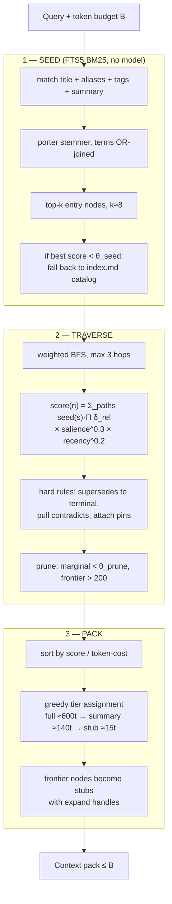
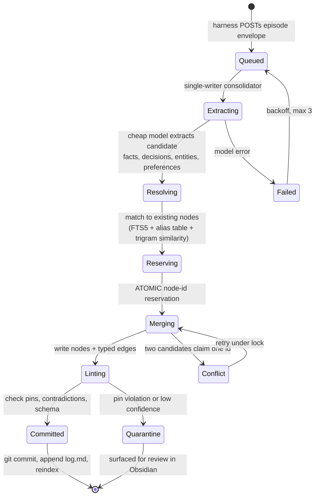

# The Brain — Retrieval & Writes

> Part of [`architecture/`](./README.md). Section numbers (§N) are stable across files — grep them.

### 5.5 Retrieval — seed, traverse, pack (no model anywhere)



**Tiering is the whole trick.** A node is never dropped for scoring low — it is **downgraded**. Ranks 1–3 render full, 4–12 as summaries, 13–60 as one-line stubs. Every stub carries its id, so the model can call `brain.expand(["decision/x"])` mid-conversation and promote exactly what it needs.

Three details pinned at P1 (the implementation is in `packages/core`): the rank bands are **minimums** — leftover budget upgrades nodes in rank order, so a five-node graph with a 4k budget renders everything full; when even all-stubs exceeds the budget, the tail is omitted **explicitly** (listed in the pack footer), never silently; and token costs are `ceil(chars/4)` — deterministic and dependency-free, which is what the budget invariant actually needs, since §5.5's tier sizes were always approximations.

The agent always knows the *shape* of what it knows at ~15 tokens per fact, and pays full price only for what it reads. This is the same progressive-disclosure pattern as `tools.search → tools.describe`, applied to memory instead of capability.

```
score(n) = Σ over paths s→n [ bm25_norm(s) · Π_{e∈path} δ_rel(e) ]
           · salience(n)^0.3 · recency(n)^0.2
```

`salience` is a usage counter with exponential decay, bumped whenever a node is rendered at full tier — nodes you actually use float up. It lives **only in SQLite**, never in the note (§5.2). `recency = exp(-age_days / 180)`. The exponents are deliberately gentle: relevance dominates, recency breaks ties. **All of these are starting values to tune against the eval set in §8.5.**

Two seed-stage corrections from P1: **prefix queries were dropped** — porter stems the index, so a prefix star on a full word (`training*`) *misses* its own stem (`train`); plain OR-joined terms with porter on both sides is strictly better. And **θ_seed landed at 5.0** on raw `-bm25` of the best hit: below it, recall returns an empty pack rather than letting one rare word (say, "parameters" in a title) drag in an entire irrelevant neighborhood. Measured on the example vault: false-positive tops ≈4.0, legitimate tops ≥6.3.

**Ties break by node id, always.** FTS5 returns equal-scoring rows in rowid order, and rowids change when the index is rebuilt — so an unstable sort would make identical queries return different packs before and after `brain rebuild`. Every ranking step sorts by `(score DESC, id ASC)`. This is what makes the determinism invariant in §8.3 actually hold.

```
── CONTEXT PACK (3,847 / 4,000 tokens · 41 nodes · 3 hops) ──
[FULL]    decision/gateway-runs-on-ec2         612t
[FULL]    constraint/discord-needs-no-ingress  488t
[SUMMARY] preference/minimal-ops-surface       142t
[SUMMARY] concept/ports-and-adapters           156t
  ... 9 more summaries
[STUB]    decision/run-everything-locally  ⚠ superseded by gateway-runs-on-ec2
[STUB]    person/... · project/... · 26 more
⚠ CONFLICT: concept/single-binary contradicts decision/split-edge-and-core
→ expand any stub with brain.expand(ids)
```

### 5.6 Cold start

You're starting from an empty vault, so the first weeks matter more than they would with bulk ingest.

- `brain.recall` on an empty or thin graph returns `{ pack: "", nodes: [], cold_start: true }` — an explicit signal, never a fabricated context.
- The system prompt instructs: on `cold_start`, skip recall and lean on `brain.note` to capture aggressively.
- **`brain init` seeds a small scaffold**: `project/`, `preference/`, and `person/me` nodes from a short interview. Ten nodes on day one is the difference between traversal working and traversal having nothing to traverse.
- The consolidator runs with a **lower extraction threshold for the first 200 nodes**, then tightens. Early over-capture is cheap; lint merges duplicates later.

### 5.7 Write path — consolidation

Chats **never** write to the graph synchronously.



Four load-bearing properties, each fixing a documented llm-wiki failure mode:

1. **Single writer + atomic reservation.** Parallel ingests forking one concept into three near-duplicate pages is the most-reported problem. A queue with one consumer plus a reservation table removes the race by construction.
2. **Pins survive.** If a change contradicts a pin on the target node → quarantine, never overwrite.
3. **Quarantine, not silent acceptance.** Low-confidence extractions and anything `provenance: untrusted` land in `quarantine/` — which is a folder in your Obsidian vault, so review is just reading notes and dragging them out.
4. **Git commit per run.** Full audit trail; `git revert` is a working undo for memory.

**Entity resolution without embeddings** uses three cheap signals in order: exact id/alias match → FTS5 BM25 on title+aliases → trigram (Jaccard on character 3-grams) over titles. Ambiguity above a threshold goes to quarantine rather than guessing. Deterministic, testable, no model.

**Episode envelope** — the single integration point for memory:

```json
{
  "schema_version": 1,
  "episode_id": "ep_01J...",
  "principal": "owner",
  "surface": "discord",
  "harness": "agent-runtime",
  "trust": "medium",
  "started_at": "2026-08-24T20:00:00Z",
  "ended_at": "2026-08-24T20:42:00Z",
  "turns": [
    { "seq": 0, "kind": "message", "role": "user", "content": "...", "ts": "..." },
    { "seq": 1, "kind": "tool_call", "urn": "github.issues.create",
      "args": {}, "result_digest": "sha256:...", "ts": "..." },
    { "seq": 2, "kind": "message", "role": "assistant", "content": "...", "ts": "..." }
  ],
  "labels": ["architecture"]
}
```

Two corrections from revision 2, both of which would have hurt at implementation time:

- **`schema_version` is mandatory.** This is the one contract every future harness writes against; without a version field, changing it later means silently misparsing old episodes.
- **One ordered `turns` array, not parallel `messages` and `tool_calls` arrays.** Real transcripts interleave, and extraction quality depends heavily on *what happened in what order* — "he asked X, the tool returned Y, then he decided Z" is the shape most decisions have. Two parallel arrays throw that ordering away and make the consolidator guess.

P0 pinned the details in `packages/contracts/episode.schema.json`: `seq` must be **strictly increasing but may have gaps** (a harness that filters turns keeps original positions), `episode_id` is `ep_` + a 26-char Crockford ULID, `result_digest` is `sha256:<64 hex>`, and message `role` is `user | assistant | system`.

Any harness that can POST this gets the brain. That's the whole contract.

**Cadence:** debounced ~10 minutes after a conversation goes idle, plus a nightly pass. Not per-message — per-message extraction produces a graph full of noise.

### 5.9 Lint

Nightly. Output is a **proposal file in the vault**, not a mutation — you approve with `brain lint --apply`.

| Check | Action |
|---|---|
| Contradictions | Two `active` nodes asserting incompatible things → add `contradicts`, flag |
| Stale | `active`, unreferenced 90d, newer node covers it → propose `supersedes` |
| Orphans | No edges → propose links or merge |
| Near-duplicates | Trigram similarity > 0.85 on title+summary → propose merge |
| Broken links | Wikilink to nonexistent note → repair or drop |
| Property/body drift | `## Links` block disagrees with frontmatter → regenerate |
| Pin violations | Generated content contradicts a pin → revert, escalate |
| Summary drift | `summary` no longer reflects body → regenerate |
| Salience decay | Apply exponential decay across all nodes |

**Blocking is mandatory, or lint does not terminate.** Contradiction and near-duplicate checks are pairwise, and all-pairs at 10⁴ nodes is 5×10⁷ comparisons — infeasible for trigrams and absurd for an LLM pass. Every pairwise check runs only within a **candidate block**:

- same `type` **and** at least one shared `tag`, **or**
- within 2 hops of each other in the graph, **or**
- top-20 FTS5 matches for the node's own title

…and only for nodes **touched since the last lint run**, tracked by a watermark. That turns a quadratic sweep into a few thousand comparisons per night. Full sweeps are available as `brain lint --full` for occasional use, and are expected to take minutes, not seconds.

### 5.10 Brain MCP contract

```
brain.recall(query, budget_tokens=4000, hops=3, types?, seeds?, as_of?)
  -> { pack, nodes:[{id,tier,score}], conflicts, expand_handles, cold_start }
brain.expand(ids[], tier)            -> upgraded renders
brain.neighbors(id, rels?, depth=1)  -> subgraph edge list
brain.note(text, links?, type?)      -> { pending_id }   # enqueues, never writes directly
brain.pin(node_id, correction, reason) -> { pin_id }     # survives all future generation
brain.timeline(query?, from?, to?)   -> episodes, chronological
brain.trace(node_id)                 -> provenance chain to source episodes
```

`brain.trace` gives every claim a citation back to the episode it came from.

**`as_of` ships in two stages** — revision 2 understated this. True git time-travel means checking out the vault at a timestamp and building a throwaway index for that tree: minutes of work per query, and a second index path to maintain.

- **P1 — cheap version.** Filter the *current* graph to nodes with `created <= as_of`, and treat `supersedes` edges created after `as_of` as not yet existing. Answers "what did I know in June" correctly for anything additive. Milliseconds, no extra machinery.
- **Later, optional — true version.** `git worktree` at the nearest commit before `as_of`, build a temp index, query, discard. Only worth building if the cheap version proves misleading in practice.

The cheap version is wrong only where a node was *edited in place* rather than superseded — which the lint rules already discourage, since superseding is the documented way to change a decision.

---

[← Index](./README.md)
