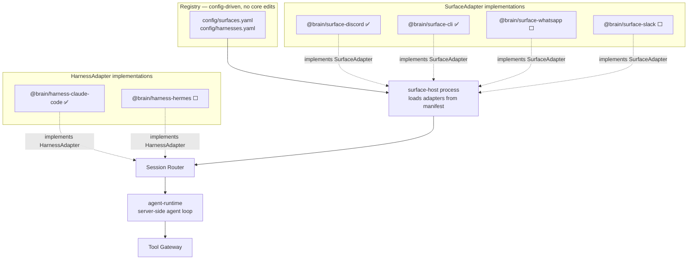
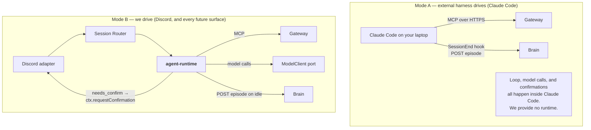
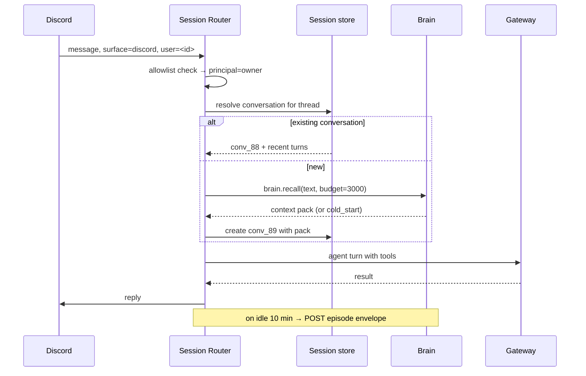

# Surfaces & Harnesses

> Part of [`architecture/`](./README.md). Section numbers (§N) are stable across files — grep them.

## 6. Component 3 — Surfaces and harnesses, open-closed

The requirement is that adding a surface or harness **never edits core**. Both are ports with manifest-driven registration.



### 6.0 The agent runtime — the piece that actually calls the model

**This was missing from revision 2 and made P6 unbuildable.** A harness "runs the agent loop," and Claude Code is the only harness — but Claude Code is a CLI on your laptop. It cannot answer a Discord message that arrives at 3am on a server. Something server-side has to run the loop, and nothing did.

So there are **two distinct execution modes**, and the architecture must name both:



`packages/agent-runtime` is a **thin loop**, not a framework:

1. On a new conversation, call `brain.recall` and seed the system prompt with the pack.
2. Call the model with the four gateway meta-tools bound.
3. Execute tool calls through the gateway.
4. **Translate gateway control responses into surface affordances** — this is the wiring revision 2 left dangling:
   - `needs_confirm` → `ctx.requestConfirmation(...)`, then retry with the `confirm_token`
   - `needs_auth` → `ctx.presentAuthLink(...)`, then retry with the `poll_token`
   - `403 insufficient_scope` → step-up re-authorization (§4.3)
5. Loop until the model stops calling tools; reply via `ctx.send`.
6. On idle, emit the episode envelope.

**Build it on the OpenAI Agents SDK** rather than hand-rolling. It supplies the agentic loop, MCP client, and tool-call plumbing; what you write is steps 1, 4, and 6 — the parts specific to this system. That keeps the estimate near the original P6 figure instead of adding a week.

**Verify MCP transport support at P6 before committing.** The whole gateway design assumes the runtime can consume an MCP server over HTTP; if the SDK's MCP support doesn't cover the transport you need, the fallback is a thin loop over the Responses API with the gateway's four meta-tools declared as functions — a day of work, not a redesign, because §4.4 deliberately keeps that surface to four tools.

Note the runtime and Claude Code now run **different models against the same gateway** — Luna server-side, Claude in your terminal. That's the `ModelClient` port and the MCP contract doing exactly what they were designed for: the model is a config value, not an architectural commitment.

**Internal service authentication.** `agent-runtime` is a confidential client on the same private network, so it does *not* do the interactive browser flow. It uses a **pre-registered client with `client_credentials`**, and its principal and trust tier come from the Session Router, passed as validated claims — never self-asserted. The interactive CIMD flow in §4.3 is for external harnesses like Claude Code only.

### 6.1 The `SurfaceAdapter` port

```ts
export interface SurfaceAdapter {
  readonly id: string;                    // "discord"
  readonly defaultTrust: TrustTier;
  start(ctx: SurfaceContext): Promise<void>;
  stop(): Promise<void>;
}

export interface SurfaceContext {
  onInbound(h: (m: InboundMessage) => Promise<void>): void;
  send(conversationId: string, m: OutboundMessage): Promise<void>;
  /** Surface-native confirmation UX — Discord buttons, CLI prompt, WhatsApp reply-keyword. */
  requestConfirmation(conversationId: string, p: ConfirmPreview): Promise<boolean>;
  /** Surface-native way to hand the user an OAuth link. */
  presentAuthLink(conversationId: string, url: string, label: string): Promise<void>;
}
```

`requestConfirmation` and `presentAuthLink` are the two affordances that differ per surface. Putting them **in the port** is precisely what lets the policy `confirm` effect and the gateway's `needs_auth` flow work on any new surface with zero core changes. Get this wrong and every new surface means touching the gateway.

Registration is config, not code:

```yaml
# config/surfaces.yaml
surfaces:
  - package: "@brain/surface-discord"
    enabled: true
    trust: medium
    config: { guildAllowlist: ["${DISCORD_GUILD_ID}"], userAllowlist: ["${DISCORD_USER_ID}"] }
```

**Conformance test suite.** `@brain/surface-testkit` exports a suite every adapter must pass — ordering, reconnect, confirmation timeout, allowlist rejection, long-message chunking. A new surface is "done" when the shared suite is green. That's the open-closed guarantee made executable.

### 6.2 Discord adapter

- **`discord.js` gateway websocket — no inbound ports.** This is why Discord is first.
- Allowlist by exact user id and guild id; everything else silently ignored. Not "authenticated" — *ignored*, so the bot is invisible to unauthorized users.
- Confirmations = message with Approve/Deny buttons and a 5-minute timeout defaulting to deny.
- `presentAuthLink` = ephemeral message so OAuth URLs never persist in channel history.
- Threads map to conversations; DMs map to a single long-running conversation.
- Trust tier **medium** in DMs, **low** in guild channels.

### 6.3 Session router



**Continuity comes from the brain, not from replaying transcripts.** Resuming loads a *context pack*, not 40k tokens of history. This is why the brain has to exist, and why cross-surface continuity later is nearly free.

**Trust follows the surface, never the conversation.** Resuming a terminal conversation on Discord downgrades permissions. Trust is never inherited upward.

### 6.4 The `HarnessAdapter` port, and Claude Code

A harness is anything that runs an agent loop. It needs exactly two things: an MCP endpoint, and a way to emit episodes.

```ts
export interface HarnessAdapter {
  readonly id: string;
  /** Write whatever config/hooks this harness needs to talk to the gateway. */
  install(cfg: InstallConfig): Promise<InstallResult>;
  /** Convert this harness's native transcript into the canonical envelope. */
  normalizeEpisode(raw: unknown): Episode;
}
```

`@brain/harness-claude-code` implements it as:

1. **MCP config** — one entry, and Claude Code discovers auth by spec:
   ```json
   { "mcpServers": { "brain-gateway": { "type": "http", "url": "https://gw.example.com/mcp" } } }
   ```
2. **`SessionEnd` hook** — a small script that reads the transcript, calls `normalizeEpisode`, and POSTs the envelope.
3. **`CLAUDE.md` snippet** — instructs the model to `brain.recall` at session start and before consequential decisions.

That's the entire Claude Code integration. **Hermes later is a sibling package**, not a refactor: same port, different `install` and `normalizeEpisode`. When it arrives, the one design question to settle is procedural memory (Hermes skills) vs semantic memory (brain nodes) — leave that line fuzzy and you'll debug contradictory memory for months. Not a Phase 1–6 problem.

**Built 2026-08-27, between P4 and P5** — the §11 argument ("every day the brain isn't running is a day of context you don't get back") applies to the harness as soon as the brain works, so Mode A shipped early with three deviations from the sketch above:

- **Delivery is the CLI, not a POST.** The brain has no HTTP surface until P5, so the `SessionEnd` hook (`packages/harness-claude-code/hooks/session-end.ts`) writes the envelope and runs `brain ingest --now`. ~~The POST swap lands in that one script when the gateway goes remote.~~ **Landed at P5 (2026-08-27):** with a gateway configured (`BRAIN_GATEWAY_URL` env, or the `.claude/brain-harness.json` that `install()` writes) the hook delivers via MCP `tools_call → brain.ingest` (§5.10) — issuer discovered from the gateway's RFC 9728 PRM, token via `client_credentials` (`BRAIN_HOOK_CLIENT_ID`/`_SECRET`, disk-cached at `~/.brain/harness-token.json` because SessionEnd is a fresh process and IdP free tiers meter M2M tokens). The local CLI is the fallback on any delivery failure — a session never breaks over memory capture, in either mode.
- **The CLAUDE.md snippet grew into a skill.** Recall/capture is judgment, not configuration: `.claude/skills/brain-memory/` carries the protocol (recall before acting; capture the moment a durable fact appears; `pin` corrections; supersede reversals; never wait for session end), and a three-line `CLAUDE.md` points at it. The SessionEnd sweep is the backstop for what in-flight capture misses, not the primary path.
- **`install()` is static for now** — the config it would write is committed to the repo instead (`.mcp.json`, `.claude/settings.json`, the skill). ~~It starts writing real config at P5.~~ **Real since P5:** `install({gatewayUrl, targetDir})` merge-writes the `.mcp.json` HTTP entry, the SessionEnd hook registration, and `.claude/brain-harness.json` (never credentials — those stay in the environment). Idempotent; existing servers and hooks are preserved.

The envelope is built by `normalizeEpisode`: deterministic episode id derived from the session id (rerunning the hook is a no-op even before the ledger's idempotency), thinking blocks / tool results / command tags / sidechain lines stripped so they never enter episodic storage, tool calls kept as digests per §5.7, oldest turns trimmed first under the §5.8 guard, and sessions below a small floor (two user turns / 200 user chars) skipped entirely — an extraction call costs money and a two-line session isn't memory.

Because SessionEnd fires after the session UI is gone, the "logged to memory" signal is out-of-band (owner request, 2026-08-27): on success the hook posts a macOS notification (`brain: session logged — +N nodes`, best-effort, macOS only), and a committed statusline (`hooks/statusline.ts`, registered in `.claude/settings.json`) shows `🧠 N nodes · last ingest Xh ago` during every session — which also confirms the previous session's sweep the moment the next one starts.

### 6.5 Trust tiers

| Tier | Surfaces | Reads | Writes | Shell/FS | Memory writes |
|---|---|---|---|---|---|
| **high** | CLI, Claude Code on your machine | allow | allow | allow | direct |
| **medium** | Discord DM | allow | confirm | deny | quarantine |
| **low** | Discord guild channel | allow | confirm | deny | quarantine |
| **untrusted** | anything not allowlisted | deny | deny | deny | never |

The memory column matters as much as the tool column. If a low-trust surface writes directly to the graph, anyone who can message you can plant a false `preference` that steers every future conversation. **Memory poisoning is the subtler attack and the more durable one.**

---

---

[← Index](./README.md)
