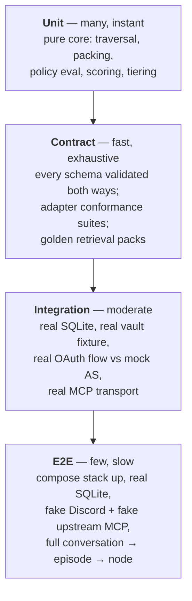

# Testing & CI/CD

> Part of [`architecture/`](./README.md). Section numbers (§N) are stable across files — grep them.

## 8. Test-driven development

### 8.1 Order of work — contracts, then tests, then code

Every phase follows: **write the contract → write failing tests against it → implement until green → refactor.** In a monorepo the discipline holds because `packages/contracts` has no dependencies and is written first, in Phase 0, before any service exists.

### 8.2 Test pyramid

Core is **pure** — no I/O, no clock, no randomness (`Clock` is a port) — so the entire traversal and packing engine is unit-testable with plain in-memory fixtures and is fully deterministic.

### 8.3 Invariants worth property-testing

These are the claims the system makes. Generate random graphs with `fast-check` and assert they never break:

| Invariant | Statement |
|---|---|
| **Budget** | `tokens(pack) ≤ budget` for every graph, query, and budget |
| **Supersedes** | If any node in a pack is superseded, its terminal successor is also in the pack |
| **Contradicts** | If a node with a `contradicts` edge is included, its counterpart is included and flagged |
| **Pins** | A pinned node renders at full tier whenever included, at any budget |
| **No drop** | A node reachable within `hops` appears at *some* tier, or was explicitly pruned by threshold — never silently lost |
| **Determinism** | Same graph + query + budget + clock → byte-identical pack |
| **Idempotent consolidation** | Ingesting the same episode twice produces zero new nodes |
| **Reservation** | Concurrent consolidation of overlapping episodes never creates duplicate ids |
| **Round-trip** | `parse(render(node)) == node` for every valid node |
| **Rebuild** | `brain rebuild` from markdown reproduces a **semantically equivalent** index |
| **Basename uniqueness** | No two notes in the vault share a basename (§5.2) |

The rebuild invariant is what lets you trust that markdown is really the source of truth — but note the wording. **SQLite files are not byte-reproducible**: page ordering, freelist reuse, and rowid assignment all vary between runs, so a hash comparison would fail forever and for no useful reason. The assertion is instead: identical node set, identical edge set, identical FTS content, and identical pack output for every query in the eval set. That's the property you actually care about.

### 8.4 Specific high-risk test targets

- **SSRF guard** — table-driven: `http://`, `169.254.169.254`, `127.0.0.1`, `10.0.0.1`, `[::1]`, DNS rebinding, redirect-to-private, oversized body, slow-loris. Each must be refused.
- **`iss` validation** — the full RFC 9207 truth table from the spec, all four rows.
- **PKCE** — refuse to proceed when `code_challenge_methods_supported` is absent.
- **Token passthrough** — assert that no inbound token value ever appears in an outbound upstream request. Implemented as a proxy-level assertion in integration tests, so it cannot regress silently.
- **Policy** — every rule with matching and non-matching inputs, plus default-fallthrough.
- **Allowlist** — non-allowlisted Discord ids produce *no* response at all.

### 8.5 Retrieval evaluation

Retrieval quality is a tuning problem, so it needs a measurement harness from day one:

- `examples/vault-example/` — a **synthetic** vault (~80 nodes, no personal data, safe to publish) with a `queries.yaml` of question → expected-node-ids.
- `brain eval` reports recall@k, whether required nodes landed at the right tier, and tokens used.
- CI runs it and **fails on regression** against a committed baseline.
- This is also how you settle §1 empirically: if lexical recall plateaus below target, the `Embedder` port earns its keep. If not, you never pay for a model.

### 8.6 CI/CD

```mermaid
flowchart LR
    PR["Pull request"] --> A["lint · typecheck · dep-cruiser<br/>(no vendor imports in core)"]
    A --> B["unit + contract<br/>coverage gate"]
    B --> C["integration<br/>SQLite + mock AS + fake MCP"]
    C --> D["e2e — compose stack"]
    D --> E["brain eval<br/>retrieval regression gate"]
    E --> F["gitleaks · CodeQL<br/>bun audit · Trivy image scan"]
    F --> G{"main?"}
    G -->|no| H["✅ status checks"]
    G -->|yes| I["build multi-arch image<br/>→ GHCR + SBOM + provenance"]
    I --> J["deploy: GitHub OIDC → Entra workload identity<br/><b>zero stored cloud keys</b>"]
    J --> K["SSM run: compose pull && up -d"]
    K --> L["brain doctor smoke test"]
    L -->|fail| M["auto-rollback to previous tag"]
```

**GitHub Actions OIDC → Entra ID workload identity federation.** No client secret and no service-principal password anywhere in the repo or in Actions secrets — `azure/login` exchanges the workflow's OIDC token for a short-lived credential, scoped to exactly the one resource group. The federated credential is pinned to `repo:mars-flat/brain:ref:refs/heads/main`, so a fork or a PR branch cannot assume it. In a public repo this is not a nicety — it removes the most valuable thing an attacker could hope to find.

Deployment itself is `az vm run-command invoke` against the VM (the Azure analog of SSM run) executing `docker compose pull && up -d`. No inbound port, no SSH key in CI.

**Branch protection:** all checks required, no force-push to `main`, secret-scanning push protection on. *Required signed commits was dropped at P0* — the implementing agent's commits are unsigned and the branch is single-writer; revisit if human collaborators arrive. Direct pushes to `main` remain allowed (no required-PR rule): the workflow is agent-driven trunk development, and required checks still gate any PR.

---

---

[← Index](./README.md)
