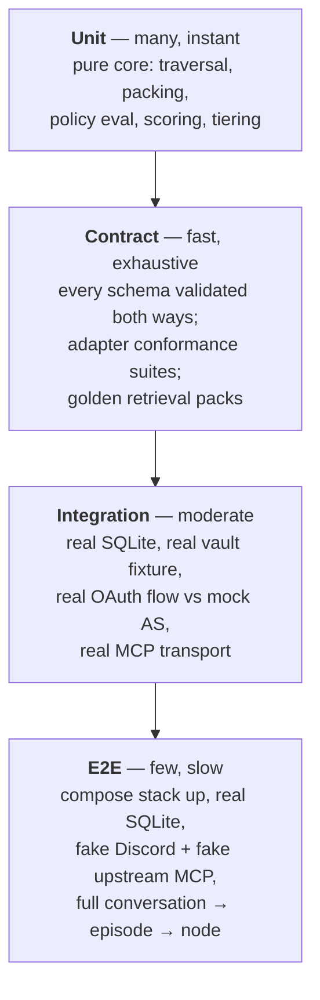

# Testing & CI/CD

> Part of [`architecture/`](./README.md). Section numbers (§N) are stable across files — grep them.

## 8. Test-driven development

### 8.1 Order of work — contracts, then tests, then code

Every phase follows: **write the contract → write failing tests against it → implement until green → refactor.** In a monorepo the discipline holds because `packages/contracts` has no dependencies and is written first, in Phase 0, before any service exists.

### 8.2 Test pyramid

Core is **pure** — no I/O, no clock, no randomness (`Clock` is a port) — so the entire traversal and packing engine is unit-testable with plain in-memory fixtures and is fully deterministic.

### 8.3 Invariants worth property-testing

These are the claims the system makes. Generate random graphs with `fast-check` and assert they never break:

| Invariant | Statement |
|---|---|
| **Budget** | `tokens(pack) ≤ budget` for every graph, query, and budget |
| **Supersedes** | If any node in a pack is superseded, its terminal successor is also in the pack |
| **Contradicts** | If a node with a `contradicts` edge is included, its counterpart is included and flagged |
| **Pins** | A pinned node renders at full tier whenever included, at any budget |
| **No drop** | A node reachable within `hops` appears at *some* tier, or was explicitly pruned by threshold — never silently lost |
| **Determinism** | Same graph + query + budget + clock **+ calibration state** → byte-identical pack |
| **Idempotent consolidation** | Ingesting the same episode twice produces zero new nodes |
| **Reservation** | Concurrent consolidation of overlapping episodes never creates duplicate ids |
| **Round-trip** | `parse(render(node)) == node` for every valid node |
| **Rebuild** | `brain rebuild` from markdown reproduces a **semantically equivalent** index |
| **Basename uniqueness** | No two notes in the vault share a basename (§5.2) |

The rebuild invariant is what lets you trust that markdown is really the source of truth — but note the wording. **SQLite files are not byte-reproducible**: page ordering, freelist reuse, and rowid assignment all vary between runs, so a hash comparison would fail forever and for no useful reason. The assertion is instead: identical node set, identical edge set, identical FTS content, **identical calibration state** (rebuild recomputes the §5.5 noise floor from a versioned deterministic probe battery, so same vault → same floor), and identical pack output for every query in the eval set. That's the property you actually care about.

### 8.4 Specific high-risk test targets

- **SSRF guard** — table-driven: `http://`, `169.254.169.254`, `127.0.0.1`, `10.0.0.1`, `[::1]`, DNS rebinding, redirect-to-private, oversized body, slow-loris. Each must be refused. *(Status 2026-09-01: the guard is built and these tests pass, but no production fetch is wired through it yet — its intended consumer, the dynamic client-metadata fetch (§4), arrives at P6. Today's outbound fetches are operator-configured or legitimately private-endpoint (the console's IMDS probe), so blanket-wiring would break them.)*
- **`iss` validation** — the full RFC 9207 truth table from the spec, all four rows.
- **PKCE** — refuse to proceed when `code_challenge_methods_supported` is absent.
- **Token passthrough** — assert that no inbound token value ever appears in an outbound upstream request. Implemented as a proxy-level assertion in integration tests, so it cannot regress silently.
- **Policy** — every rule with matching and non-matching inputs, plus default-fallthrough.
- **Allowlist** — non-allowlisted Discord ids produce *no* response at all.

### 8.5 Retrieval evaluation

Retrieval quality is a tuning problem, so it needs a measurement harness from day one:

- `examples/vault-example/` — a **synthetic** vault (~80 nodes, no personal data, safe to publish) with a `queries.yaml` of question → expected-node-ids.
- `brain eval` reports recall@k, whether required nodes landed at the right tier, and tokens used.
- CI runs it and **fails on regression** against a committed baseline.
- This is also how you settle §1 empirically: if lexical recall plateaus below target, the `Embedder` port earns its keep. If not, you never pay for a model.

**The adversarial paraphrase suite** (added 2026-08-31, after the main suite
saturated at 1.0 — a ceiling-hit eval can't detect the lexical↔semantic gap).
`brain eval --paraphrase` runs `queries-paraphrase.yaml`: questions phrased in
deliberately different vocabulary than their target nodes. Expectations
flagged `paraphrase: true` are **mechanically enforced** to share zero
content-word stems with the target's indexed text — the FTS porter tokenizer
itself is the authority (a single-term MATCH against the target row), because
hand-authored "paraphrases" turn out to overlap invisibly more than half the
time. A flagged target can therefore never be a BM25 seed, so any pack
appearance is graph-traversal recovery. The suite scores the two stages
separately:

- **seed-recall** — expected nodes BM25 found lexically
- **pack-recall / ¶-recall** — expected (and zero-overlap) nodes in the final pack
- **recovery** — unseeded expected nodes rescued by traversal (the §1 bet, as a number)
- **placement** — expected nodes at or above their required tier
- **abstention** — `expect: []` probes with vault-adjacent vocabulary on
  foreign topics answered with silence, not a confident wrong pack

Enforcement violations always fail the run — a suite whose queries lexically
reach their targets measures nothing. CI gates both suites against committed
baselines; the paraphrase baseline records honest misses, and the gate is
no-regression, not perfection. The main suite staying at 1.0 is a hard
constraint on any retrieval tuning (§5.5 parameters); the paraphrase metrics
are what tuning is allowed to move. An abstention probe fails only when
answered **confidently** — a hedged pack is the designed degradation.

**`brain tune`** is how the §5.5 constants earn their values: a coarse-grid
sweep (~1,600 candidates, no model, ~10 minutes) over the abstention
weights/bands, feasible = original suite at 1.0, objective = the paraphrase
aggregates. Deterministic and stable across reruns (ties break toward
current values). The chosen constants are applied to `DEFAULT_RECALL_PARAMS`
by hand with provenance in the comment, and the two baselines gate them
forever after. Rerun it before touching any retrieval constant.

### 8.6 CI/CD

```mermaid
flowchart LR
    PR["Pull request"] --> A["lint · typecheck · dep-cruiser<br/>(no vendor imports in core)"]
    A --> B["unit + contract<br/>coverage gate"]
    B --> C["integration<br/>SQLite + mock AS + fake MCP"]
    C --> D["e2e — compose stack"]
    D --> E["brain eval<br/>retrieval regression gate"]
    E --> F["gitleaks · CodeQL<br/>bun audit · Trivy image scan"]
    F --> G{"main?"}
    G -->|no| H["✅ status checks"]
    G -->|yes| I["build multi-arch image<br/>→ GHCR + SBOM + provenance"]
    I --> J["deploy: GitHub OIDC → Entra workload identity<br/><b>zero stored cloud keys</b>"]
    J --> K["SSM run: compose pull && up -d"]
    K --> L["brain doctor smoke test"]
    L -->|fail| M["auto-rollback to previous tag"]
```

**GitHub Actions OIDC → Entra ID workload identity federation.** No client secret and no service-principal password anywhere in the repo or in Actions secrets — `azure/login` exchanges the workflow's OIDC token for a short-lived credential, scoped to exactly the one resource group. The federated credential is pinned to `repo:mars-flat/brain:ref:refs/heads/main`, so a fork or a PR branch cannot assume it. In a public repo this is not a nicety — it removes the most valuable thing an attacker could hope to find.

Deployment itself is `az vm run-command invoke` against the VM (the Azure analog of SSM run) executing `docker compose pull && up -d`. No inbound port, no SSH key in CI.

*Implemented at P5 (2026-08-27), `deploy.yml` + `deploy/vm/deploy.sh`:* the Entra app is `brain-deploy` (Virtual Machine Contributor on `rg-brain` only); `AZURE_CLIENT_ID`/`TENANT_ID`/`SUBSCRIPTION_ID` are repo **variables**, not secrets — there is nothing secret to store. The image job publishes multi-arch (amd64 for CI, arm64 for the VM) to GHCR with SBOM + max provenance on every main push. Two mechanics worth knowing: `run-command` does not propagate script exit codes, so the on-VM script speaks a `DEPLOY-OK` / `ROLLED-BACK` / `ROLLBACK-FAILED` marker contract the workflow greps; and while the VM doesn't exist yet the deploy job skips cleanly, so the pipeline was landed and green before provisioning. The rollback target is simply the previous `TAG=` in the VM's compose `.env`; `docker compose up --wait` (gateway healthcheck) plus `brain doctor` are the smoke gate — preceded by a vault ownership normalize + index rebuild, because root-context ops (deploys, ad-hoc pulls) otherwise strand root-owned files the uid-1000 consolidator can't write (`deploy/vm/vault-pull.sh` is the safe ad-hoc path). Manual redeploy of any commit = `workflow_dispatch` from that commit's ref.

**Branch protection:** all four checks (`checks`, `repo-split-guard`, `gitleaks`, `codeql`) are **Required** on `main`; no force-push or deletion (admins included); secret-scanning push protection and private vulnerability reporting on. **Work lands via branch → PR → auto-merge once pre-merge CI is green** (owner directive, post-P2) — `gh pr merge --auto --rebase`, rebase-merge so the per-commit narrative survives, branch deleted on merge. Direct pushes of unchecked SHAs to `main` are refused as a consequence. Two deliberate softenings remain: no required review (single maintainer — a review requirement would deadlock self-merges) and no required signed commits (the implementing agent's commits are unsigned).

---

---

[← Index](./README.md)
