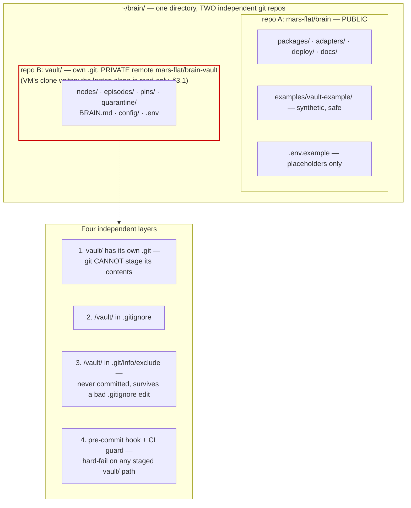

# Public Repo Safety

> Part of [`architecture/`](./README.md). Section numbers (§N) are stable across files — grep them.

## 9. Public repository safety

The code repo is public. This drives several non-negotiable design choices.

### 9.1 The vault never enters the public repo — defence in depth

The vault is verbatim personal conversation. It sits at **`brain/vault/`** for convenience, but it is **its own independent git repository**, and the public repo must never contain a byte of it.

Once something is pushed public, treat it as permanent: force-push does not remove objects from GitHub's fork network, and they stay retrievable by commit SHA. So this gets four independent layers, not one `.gitignore` line.



**Layer 1 is the one that actually saves you.** Git does not recurse into a directory containing its own `.git`. A catastrophic `git add -A && git commit && git push` in the parent repo stages `vault` as a **gitlink** — a single 40-character commit SHA — and prints an "adding embedded git repository" warning. **File contents are never staged.** A leak now requires two independent failures instead of one.

Layer 4 defeats the remaining hole, `git add -f`:

```bash
# .githooks/pre-commit  (git config core.hooksPath .githooks) — abridged
staged="$(git diff --cached --name-only)"
if grep -qE '^(vault/|azure/)' <<<"$staged"; then
  echo "REFUSING: staged path under vault/ or azure/. These are private (§9.1)." >&2
  exit 1
fi
if grep -E '(^|/)\.env' <<<"$staged" | grep -qv '\.env\.example$'; then
  echo "REFUSING: staged .env file. Only .env.example is committed (§9.2)." >&2
  exit 1
fi
command -v gitleaks >/dev/null && gitleaks git --pre-commit --staged --redact --no-banner
```

The hook also refuses `azure/` (the private account config) and any staged `.env`, and runs gitleaks only when it is installed — otherwise it warns and CI's full-history scan is the backstop.

**Why this matters more than usual here:** this repo is worked on by agents. `git add -A` is one plausible autonomous action away at any time, and the blast radius is your entire conversational history, published. The nested repo makes that action *structurally* incapable of leaking content rather than merely discouraged from it.

**Vault location is still explicit.** `BRAIN_VAULT_PATH` is required with **no default** in the CLI, the gateway, brain-mcp and the console — a missing config fails loudly rather than silently writing notes somewhere git-tracked. `.env.example` ships `BRAIN_VAULT_PATH=./vault`. The one exception is the SessionEnd hook, which defaults to `<project>/vault` and only acts on it if a `BRAIN.md` is there — inert in a clean clone (§6.4).

**CI guard:** a job fails the build if anything under `vault/` or `azure/` is tracked, if any path matching `nodes/`, `episodes/`, `pins/`, `quarantine/` is tracked outside `examples/`, or if any `.env` other than `.env.example` is tracked.

#### Why a git repo and not just a gitignored folder

Making the vault a git repo — even with no remote — costs one `git init` and preserves three things the architecture already depends on:

| Property | Needs git history |
|---|---|
| `git revert` as memory undo (§5.7) | yes — a bad consolidation run is otherwise unrecoverable |
| `as_of` time travel in `brain.recall` (§5.10) | yes |
| `brain.trace` provenance over time | yes |
| Adding a private remote later | one command, no migration |

Without local history, a bad consolidation silently rewrites a decision node and the prior version is simply gone.

#### Backups — the real risk of going local-only

Losing the vault is worse than losing the code. Code is reproducible; a year of conversational memory is not. Local-only with no remote is one disk failure from total loss. Pick at least one:

| Option | Setup | Notes |
|---|---|---|
| **Time Machine** | already on macOS, verify it covers `~/brain` | Cheapest. Confirm the path isn't excluded |
| **`brain backup`** | plain `tar.gz` of the vault (with `_index/brain.db`) and the tasks store → wherever you put it | **Not encrypted** — `age` was dropped (§13) and no replacement was built, so the destination has to be trusted (Time Machine, a private disk, the private remote). The tarball contains verbatim conversation |
| **Private GitHub remote** | `git remote add` + push | Free, offsite, versioned. **Done 2026-08-27** — `mars-flat/brain-vault`, pushed nightly by the VM's `brain-vault-push` timer (§3.1) |
| **Obsidian Sync** | paid | Also gets you the vault on mobile |

**Recommendation was Time Machine now, private remote at P5** — both hold today: the remote exists and the VM pushes to it nightly, and the laptop's read-only clone is what Time Machine sees.

#### Alternative placements considered

| Placement | Leak risk | Convenience | Verdict |
|---|---|---|---|
| `brain/vault/` **as nested git repo** | very low — two failures required | one tree, Obsidian opens it in place | ✅ **recommended** |
| `brain/vault/` plain gitignored folder | moderate — one `.gitignore` edit or `add -f` | same | acceptable, but strictly worse for zero saving |
| `~/brain-vault/` outside the tree | none — unreachable by git in the code repo | two locations to remember | safest; pick this if agents ever run with broad write access |
| Private GitHub repo from day one | none | second repo to manage | the P5 destination, not a P0 requirement |

The middle two differ only in five seconds of setup, so take the nested repo. If you later want maximum paranoia, moving to `~/brain-vault/` is a `mv` and one `.env` edit — `BRAIN_VAULT_PATH` already makes location a config concern.

#### Vault-internal `.gitignore`

```gitignore
_index/                      # derived SQLite, rebuildable
log.md                       # Layer 2 derived (git log is the durable audit trail)
index.md                     # reserved for a Bases-generated catalog (nothing writes it today, §5.1)
lint-proposals.md            # lint working output (§5.9)
.obsidian/workspace*.json    # churns on every pane move
.obsidian/cache
.env
.DS_Store
secrets/master.key           # the store (secrets/store.json) MAY be committed; the key never (§4.3)
```

Keep the rest of `.obsidian/` tracked — your graph-view filters, property types, and hotkeys are worth versioning.

### 9.2 Secrets

- **Only `.env.example` is committed**, with placeholders (`OPENAI_API_KEY=sk-REPLACE_ME`).
- `.gitignore`: `.env*` (negated for `.env.example`), `_index/`, `*.db`, `*.age`, `config/policy.yaml`, `config/servers.yaml`.
- **gitleaks** as a pre-commit hook *and* a CI job. Pre-commit stops the mistake when gitleaks is installed locally (`brew install gitleaks`; the hook warns otherwise); CI scans the full history regardless and catches a bypassed or absent hook.
- **GitHub secret-scanning push protection** enabled on the repo.
- Runtime secrets come from the `SecretStore` port — never `process.env` read directly in core.
- **Log redaction: not built.** Revision 5 specified a structured logger that scrubs `token`, `secret`, `authorization`, `code`, `refresh_token` and `password` fields, with a unit test. Nothing of the kind exists (2026-09-24 audit). What holds instead: secrets reach code only through the `SecretStore` port, the gateway's audit log records argument *digests*, never values (§4.5), and the upstream children get a scrubbed environment (§8.4). A redacting logger is still worth building the day anything logs request bodies.
- Config files carrying real server inventory and policy live in the **vault**, not the code repo. An attacker reading the public repo learns the architecture — which is fine, per Kerckhoffs — but not your tool inventory or your allowlist.

### 9.3 Dependencies

| Control | Implementation |
|---|---|
| Reproducible installs | `bun.lock` committed; CI uses `bun install --frozen-lockfile` |
| Install-script attacks | **Bun does not run lifecycle scripts by default** — a package needs an explicit `trustedDependencies` entry. Note the caveat: the top-500 npm packages with scripts are auto-trusted, so this is a strong default rather than an absolute block. Audit that list at each phase and pin `--ignore-scripts` in CI for full determinism |
| Known vulnerabilities | `bun audit --audit-level=high` gates the build |
| Update cadence | Dependabot, grouped weekly PRs for bun packages and GitHub Actions. **Auto-merge is deliberately off** — bumps are merged by hand until CI has earned that trust (`.github/dependabot.yml`) |
| Minimal surface | Dependency budget per package, reviewed at each phase. Prefer Bun built-ins — `bun:sqlite`, `bun test`, and `node:crypto` remove three dependencies outright |
| Base images | Pinned **by digest**, not tag (`oven/bun`, `caddy`, `goacme/lego`). **No scheduled rebuild exists** — the image is rebuilt on every push to `main` only, and Dependabot has no `docker` ecosystem entry, so refreshing a base digest is a manual edit. Revision 5 planned a weekly rebuild; nothing has forced it yet |
| Image scanning | **Not built.** Revision 5 planned Trivy on every build with high/critical failing. What runs: `bun audit --audit-level=high` on the dependency tree, CodeQL, gitleaks. Container-level CVE scanning is still intended |
| Provenance | SBOM (buildx default, SPDX) + build provenance attestation (`mode=max`) published with each image |
| SAST | CodeQL on PR and on a schedule |

### 9.4 Packaging for someone else

Single-tenant, but a stranger should be able to run it end to end:

- **Zero hardcoded identity** in code, tests and fixtures. The CI grep asserts two things: no absolute home path and no consumer-domain email in any tracked file. Two deliberate exceptions the grep does not cover: `LICENSE` carries the owner's real name (their call, 2026-09-01), and the tailnet hostname stays out of the repo by discipline rather than by a check (§9.2).
- **`brain init`** — creates the vault skeleton (`nodes/ episodes/ pins/ quarantine/ config/ .obsidian/`), writes `BRAIN.md`, the vault `.gitignore` and `.obsidian/app.json`, runs `git init`, and prints next steps. It does **not** generate `.env`, create the master key (that happens lazily on the first `brain secret set`) or run a seed interview — §5.6's interview was never built; the printed hint says to seed with `brain note` instead. Its human checklist is §13.
- **`brain doctor`** — verifies the vault (path, own `.git`, parses clean) and the index (present, fresh). Nothing more: no connectivity or credential checks (§3.1 step 4 says what covers those). First thing to run after any deploy or migration.
- **`docs/SETUP.md`** — developer setup for a clean clone: prerequisites, hooks, `bun run check`, where the private vault goes. Not a laptop-to-Discord walkthrough; there is no Discord surface yet.
- **`examples/vault-example/`** — a working synthetic vault so `brain eval` and the e2e tests run on a clean clone with no setup.
- **Licence:** MIT. **`SECURITY.md`** with a private disclosure path.

---

---

[← Index](./README.md)
