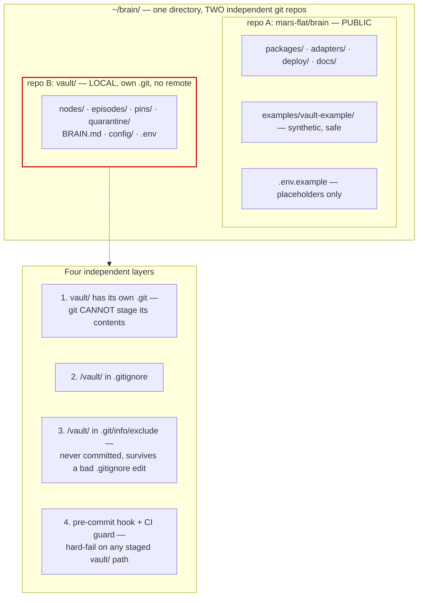

# Public Repo Safety

> Part of [`architecture/`](./README.md). Section numbers (§N) are stable across files — grep them.

## 9. Public repository safety

The code repo is public. This drives several non-negotiable design choices.

### 9.1 The vault never enters the public repo — defence in depth

The vault is verbatim personal conversation. It sits at **`brain/vault/`** for convenience, but it is **its own independent git repository**, and the public repo must never contain a byte of it.

Once something is pushed public, treat it as permanent: force-push does not remove objects from GitHub's fork network, and they stay retrievable by commit SHA. So this gets four independent layers, not one `.gitignore` line.



**Layer 1 is the one that actually saves you.** Git does not recurse into a directory containing its own `.git`. A catastrophic `git add -A && git commit && git push` in the parent repo stages `vault` as a **gitlink** — a single 40-character commit SHA — and prints an "adding embedded git repository" warning. **File contents are never staged.** A leak now requires two independent failures instead of one.

Layer 4 defeats the remaining hole, `git add -f`:

```bash
# .githooks/pre-commit  (git config core.hooksPath .githooks)
if git diff --cached --name-only | grep -qE '^vault/'; then
  echo "REFUSING: staged path under vault/. The vault is private." >&2
  exit 1
fi
```

**Why this matters more than usual here:** this repo is worked on by agents. `git add -A` is one plausible autonomous action away at any time, and the blast radius is your entire conversational history, published. The nested repo makes that action *structurally* incapable of leaking content rather than merely discouraged from it.

**Vault location is still explicit.** `BRAIN_VAULT_PATH` is required with **no default** — a missing config fails loudly rather than silently writing notes somewhere git-tracked. `.env.example` ships `BRAIN_VAULT_PATH=./vault`.

**CI guard:** a job fails the build if any path matching `nodes/`, `episodes/`, `pins/`, `quarantine/`, or `*.env` (other than `.env.example`) is tracked outside `examples/`.

#### Why a git repo and not just a gitignored folder

Making the vault a git repo — even with no remote — costs one `git init` and preserves three things the architecture already depends on:

| Property | Needs git history |
|---|---|
| `git revert` as memory undo (§5.7) | yes — a bad consolidation run is otherwise unrecoverable |
| `as_of` time travel in `brain.recall` (§5.10) | yes |
| `brain.trace` provenance over time | yes |
| Adding a private remote later | one command, no migration |

Without local history, a bad consolidation silently rewrites a decision node and the prior version is simply gone.

#### Backups — the real risk of going local-only

Losing the vault is worse than losing the code. Code is reproducible; a year of conversational memory is not. Local-only with no remote is one disk failure from total loss. Pick at least one:

| Option | Setup | Notes |
|---|---|---|
| **Time Machine** | already on macOS, verify it covers `~/brain` | Cheapest. Confirm the path isn't excluded |
| **`brain backup`** | `age`-encrypted tarball → iCloud/Dropbox/S3 | Encrypted at rest, so the destination doesn't need to be trusted |
| **Private GitHub remote** | `git remote add` + push | Free, offsite, versioned. Trivially added later since it's already a repo |
| **Obsidian Sync** | paid | Also gets you the vault on mobile |

**Recommendation: Time Machine now, private remote at P5** — by then the vault holds enough that offsite matters.

#### Alternative placements considered

| Placement | Leak risk | Convenience | Verdict |
|---|---|---|---|
| `brain/vault/` **as nested git repo** | very low — two failures required | one tree, Obsidian opens it in place | ✅ **recommended** |
| `brain/vault/` plain gitignored folder | moderate — one `.gitignore` edit or `add -f` | same | acceptable, but strictly worse for zero saving |
| `~/brain-vault/` outside the tree | none — unreachable by git in the code repo | two locations to remember | safest; pick this if agents ever run with broad write access |
| Private GitHub repo from day one | none | second repo to manage | the P5 destination, not a P0 requirement |

The middle two differ only in five seconds of setup, so take the nested repo. If you later want maximum paranoia, moving to `~/brain-vault/` is a `mv` and one `.env` edit — `BRAIN_VAULT_PATH` already makes location a config concern.

#### Vault-internal `.gitignore`

```gitignore
_index/                      # derived SQLite, rebuildable
log.md                       # Layer 2 derived (git log is the durable audit trail)
index.md                     # Layer 2 derived (Bases-generated in Obsidian)
lint-proposals.md            # lint working output (§5.9)
.obsidian/workspace*.json    # churns on every pane move
.obsidian/cache
.env
```

Keep the rest of `.obsidian/` tracked — your graph-view filters, property types, and hotkeys are worth versioning.

### 9.2 Secrets

- **Only `.env.example` is committed**, with placeholders (`DISCORD_BOT_TOKEN=xoxb-REPLACE_ME`).
- `.gitignore`: `.env*` (negated for `.env.example`), `_index/`, `*.db`, `*.age`, `config/policy.yaml`, `config/servers.yaml`.
- **gitleaks** as a pre-commit hook *and* a CI job. Pre-commit stops the mistake; CI catches a bypassed hook.
- **GitHub secret-scanning push protection** enabled on the repo.
- Runtime secrets come from the `SecretStore` port — never `process.env` read directly in core.
- **Structured logging with a redaction layer**: fields named `token`, `secret`, `authorization`, `code`, `refresh_token`, `password` are replaced before the log line is formatted, with a unit test proving it.
- Config files carrying real server inventory and policy live in the **vault**, not the code repo. An attacker reading the public repo learns the architecture — which is fine, per Kerckhoffs — but not your tool inventory or your allowlist.

### 9.3 Dependencies

| Control | Implementation |
|---|---|
| Reproducible installs | `bun.lock` committed; CI uses `bun install --frozen-lockfile` |
| Install-script attacks | **Bun does not run lifecycle scripts by default** — a package needs an explicit `trustedDependencies` entry. Note the caveat: the top-500 npm packages with scripts are auto-trusted, so this is a strong default rather than an absolute block. Audit that list at each phase and pin `--ignore-scripts` in CI for full determinism |
| Known vulnerabilities | `bun audit --audit-level=high` gates the build |
| Update cadence | Dependabot, grouped weekly PRs, auto-merge only on green patch-level updates |
| Minimal surface | Dependency budget per package, reviewed at each phase. Prefer Bun built-ins — `bun:sqlite`, `bun test`, and `node:crypto` remove three dependencies outright |
| Base images | Pinned **by digest**, not tag; rebuilt weekly by a scheduled workflow |
| Image scanning | Trivy on every build, high/critical fails |
| Provenance | SBOM (CycloneDX) + build provenance attestation published with each image |
| SAST | CodeQL on PR and on a schedule |

### 9.4 Packaging for someone else

Single-tenant, but a stranger should be able to run it end to end:

- **Zero hardcoded identity.** No name, id, email, or path anywhere in code, tests, or fixtures. A CI grep asserts this.
- **`brain init`** — interactive bootstrap: creates the vault skeleton and its git repo, writes `BRAIN.md`, generates `.env` from `.env.example`, creates the master key, runs the seed interview (§5.6), prints next steps. Its checklist is §13.
- **`brain doctor`** — verifies config, connectivity, index integrity, credential validity. First thing to run after any deploy or migration.
- **`docs/SETUP.md`** — laptop-to-Discord in under 30 minutes.
- **`examples/vault-example/`** — a working synthetic vault so `brain eval` and the e2e tests run on a clean clone with no setup.
- **Licence:** MIT. **`SECURITY.md`** with a private disclosure path.

---

---

[← Index](./README.md)
