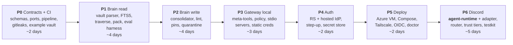

# Layout, Roadmap & Open Questions

> Part of [`architecture/`](./README.md). Section numbers (§N) are stable across files — grep them.

## 10. Repository layout

```
mars-flat/brain/                    # PUBLIC
├── packages/
│   ├── contracts/                  # schemas + types, ZERO deps, written first
│   │   ├── episode.schema.json  node.schema.json  policy.schema.json
│   │   └── src/{gateway-tools,brain-tools,ports}.ts
│   ├── core/                       # pure domain logic — no I/O, no vendor SDKs
│   │   └── src/{traverse,pack,score,policy,consolidate,lint,resolve}.ts
│   ├── gateway/                    # tool gateway service
│   │   └── src/{rs,as,cimd,credentials,index,pool,audit}.ts
│   ├── brainstore/                 # vault read/write + SQLite FTS5 index
│   ├── brain-mcp/                  # brain exposed as an MCP server
│   ├── consolidator/               # episode → nodes, single writer
│   ├── agent-runtime/              # server-side agent loop (OpenAI Agents SDK)
│   ├── surface-host/               # loads SurfaceAdapters from manifest
│   ├── surface-discord/            # ← plugin
│   ├── surface-cli/                # ← plugin
│   ├── surface-testkit/            # conformance suite every adapter must pass
│   ├── harness-claude-code/        # MCP config + SessionEnd hook + CLAUDE.md
│   └── cli/                        # brain init | doctor | rebuild | lint | eval | backup
├── adapters/
│   ├── secrets-file/  secrets-aws/
│   ├── queue-sqlite/  queue-sqs/
│   ├── object-fs/     object-s3/
│   └── embedder-null/              # embedder-openai/ only if §8.5 demands it
├── deploy/
│   ├── compose/{compose.yaml,compose.dev.yaml,Caddyfile}
│   └── bicep/azure/                # optional managed path
├── examples/vault-example/         # synthetic vault + queries.yaml
├── docs/{SETUP.md,SECURITY.md,MIGRATION.md,ADR/}
├── .github/workflows/{ci.yml,deploy.yml,scan.yml,deps.yml}
├── .githooks/pre-commit            # refuses any staged vault/ path
├── bunfig.toml  bun.lock  .env.example  .gitleaks.toml  .dependency-cruiser.js
│
└── vault/                          # ← SEPARATE GIT REPO. gitignored here.
    ├── .git/                       #   own history; private remote since P5 (§12 Q1)
    ├── .obsidian/                  #   open this folder as your Obsidian vault
    ├── BRAIN.md                    #   Layer-3 schema
    ├── nodes/ episodes/ pins/ quarantine/
    ├── config/{policy.yaml,servers.yaml}
    └── _index/brain.db             #   derived, gitignored in the vault repo
```

`vault/` appears in this tree for orientation only — the parent repo never tracks it (§9.1).

**TypeScript on Bun throughout.** The MCP SDK is first-class in TypeScript, and one language keeps schema code shared between gateway and brain. Bun specifically buys four things this design was already asking for:

| Bun gives you | Replaces |
|---|---|
| **`bun:sqlite`** — SQLite built into the runtime | `better-sqlite3` — a native module with a compile step, and the single most annoying dependency in a multi-arch Docker build |
| **`bun test`** — built-in runner, Jest-compatible | vitest/jest + config. §8's four-tier pyramid runs on it directly; `fast-check` still slots in for the property tests |
| **Native TypeScript** — no transpile step | tsc/esbuild in the dev loop and the Dockerfile |
| **Lifecycle scripts off by default** | `npm ci --ignore-scripts` discipline you have to remember (§9.3) |

`bun:sqlite` covers FTS5, which is all §5.11 needs — and since §1 already cut embeddings, there's no extension-loading requirement to worry about. Base image is `oven/bun`, pinned by digest.

**`docs/ADR/`** — one short architecture decision record per significant choice. The brain will eventually hold these too, but ADRs in the public repo are how a stranger understands *why*.

---

## 11. Build order

Phases 0–4 are entirely local. Azure appears in Phase 5.



**Brain before gateway** — inverted from revision 1. With no bulk ingest, the graph needs to start accumulating from your earliest real conversations. Every day the brain isn't running is a day of context you don't get back. The gateway has no such urgency.

| Phase | Deliverable | Done when |
|---|---|---|
| **P0** | `contracts/`, CI green, example vault, gitleaks, repo split enforced | A clean clone runs `bun install && bun test` green with no config |
| **P1** | Vault parse, FTS5 index, traversal, packing, `brain eval` | All §8.3 invariants pass; eval baseline committed; recall on example vault meets target |
| **P2** | Consolidator, lint, pins, quarantine, git commits | Same episode ingested twice yields zero new nodes; concurrent overlapping episodes yield no duplicates |
| **P3** | Gateway with 3–4 stdio servers, meta-tools, policy | Claude Code connects locally; `tools.search` finds the right tool; base context < 1k tokens |
| **P4** | Gateway as resource server, hosted IdP as AS, both credential planes, encrypted secrets | Claude Code completes OAuth against the IdP; token-passthrough assertion holds; step-up works end to end. *(Option A adds ~2 days and the SSRF + `iss` suites)* |
| **P5** | Azure VM + Compose + Tailscale + OIDC deploy + rollback | Push to `main` deploys; `brain doctor` green; **restore-to-a-different-host drill succeeds** |
| **P6** | **agent-runtime**, Discord adapter, session router, trust tiers | Message on Discord → recall → tool call with button confirm → reply → episode lands in the vault; non-allowlisted user gets no response |

Estimates are working days and they're guesses. **P2 is most likely to double** — extraction quality is tuning, not coding. **P6 grew from 3 to 5 days** because revision 2 had no server-side agent loop at all (§6.0).

**P4½ (2026-08-27): `harness-claude-code` Mode A shipped early**, out of phase order. The "brain before gateway" logic above compounds once both work: every Claude Code session that isn't captured is lost context, and P5 was blocked on the owner anyway. Scope and deviations in §6.4.

---

## 12. Open questions

| # | Question | My default if you don't weigh in |
|---|---|---|
| 1 | ~~Where does the vault live?~~ **Decided:** `brain/vault/`, nested git repo (§9.1). **Private remote created 2026-08-27** (`mars-flat/brain-vault`, visibility verified before the first push; history audited — `secrets/master.key` never tracked, the envelope-encrypted `secrets/store.json` is deliberately committed per §4.3) | ~~accepted single-disk loss risk~~ — closed by the remote |
| 2 | Public repo now, or after P4 hardening? | **Public from P0.** Retrofitting secret hygiene is how secrets leak. Starting public forces the discipline while the repo is empty |
| 3 | ~~Domain for the gateway?~~ **Moot** — dropping the public IP removed the TLS requirement (§3.1) | Revisit only when WhatsApp needs a public webhook |
| 4 | ~~Cheap model for consolidation?~~ **Decided:** `gpt-5.6-luna` at `medium` effort via Batch API (§5.8). *P2 note:* extraction runs synchronously for now — Batch's 24h ceiling is wrong for an interactive dev loop; switch to Batch at P5 when consolidation becomes a background cadence | Re-baseline after a week of real episodes. Effort, not model, is the cost lever — raise to `high` only if extraction quality demands it |
| 5 | Does the Discord bot join a server, or DM only? | **DM only** at first. One user, no channel-permission surface area |
| 6 | ~~Self-hosted authorization server, or hosted IdP?~~ **Decided (owner, 2026-08-25): the gateway is a resource server against a local Keycloak container for P4; hosted IdP arrives at P5** — "test as much as possible locally before moving remote". Same RS code either way; the swap is one issuer URL in config (§4.3). **P5 provider chosen (owner, 2026-08-27): Auth0** — account created; tenant configuration is the remaining step (§13) | ~~Hosted IdP~~ — superseded by the local-first Keycloak choice; the self-host-vs-hosted analysis in §4.3 still holds for P5 |
| 7 | Does `agent-runtime` use the OpenAI Agents SDK, or a hand-rolled loop? (§6.0) | **Agents SDK**, pending an MCP-transport check at P6. The loop and tool plumbing are not where your differentiation is |
| 8 | ~~**Raise the Azure budgets before P5?** (§3.2)~~ **Done (2026-08-27):** re-spaced at *double* the suggested values — `monthly-tripwire` → 110 CAD, `auto-shutdown-cap` → 180 CAD, `total-credit-cap` → 2000 CAD — owner's call, the credit pool grew substantially. Action-group wiring preserved and re-verified (§3.2). The OpenAI dashboard limit is also set (owner, same day) — **both P5 gates are clear** | ~~Yes — 55/90~~ superseded by the doubled values |

---

---

[← Index](./README.md)
